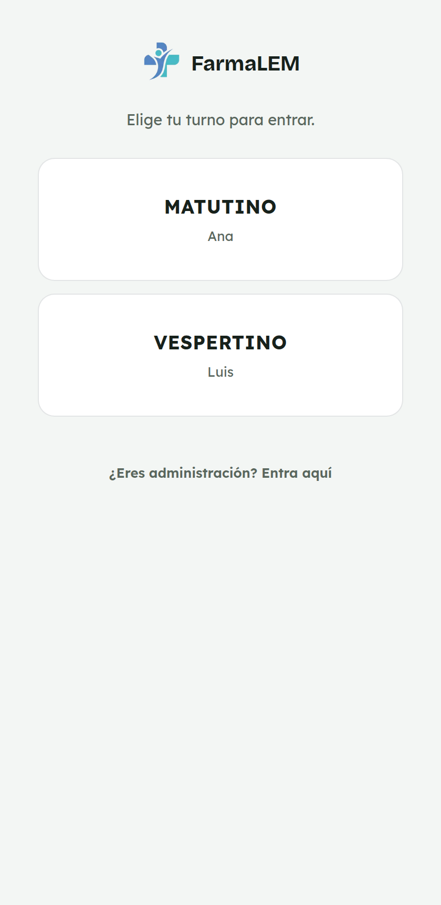
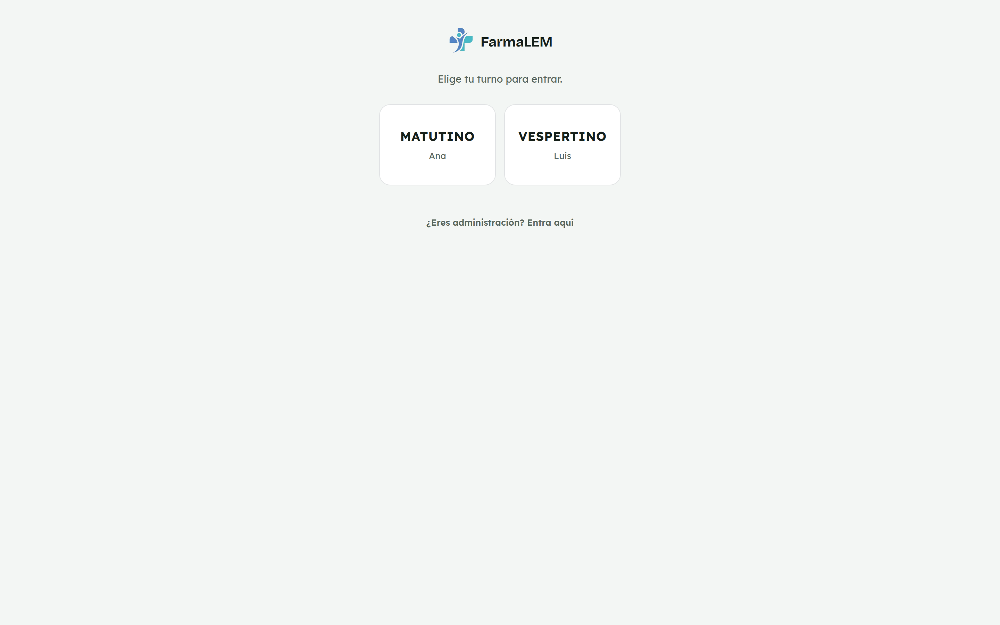
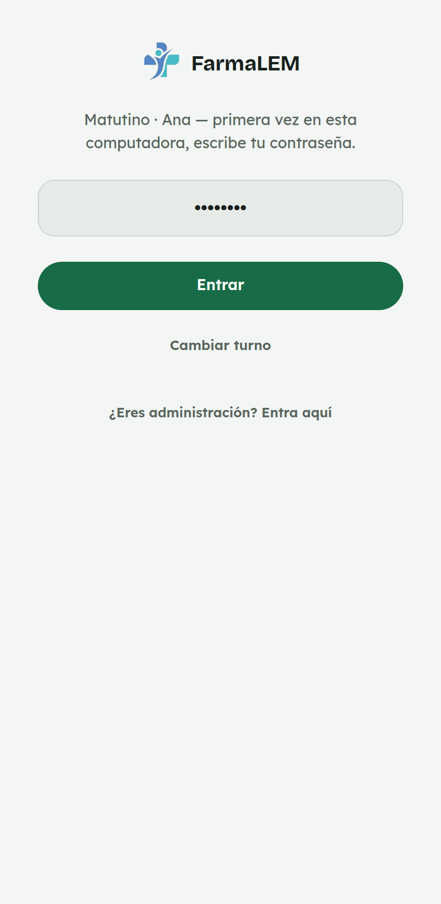
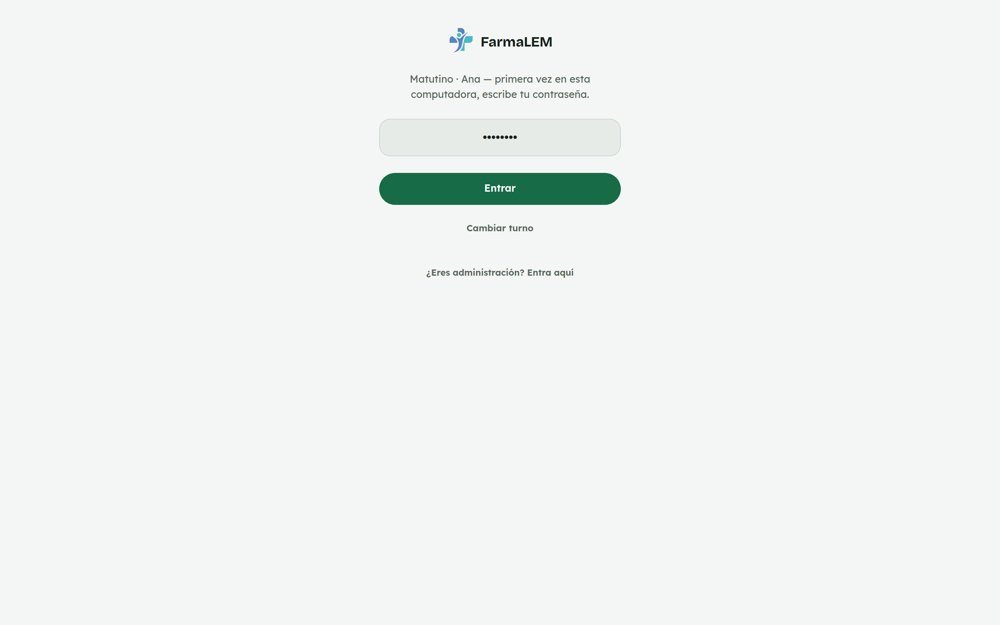
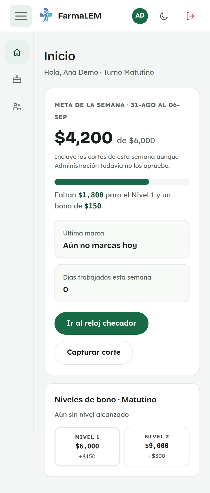
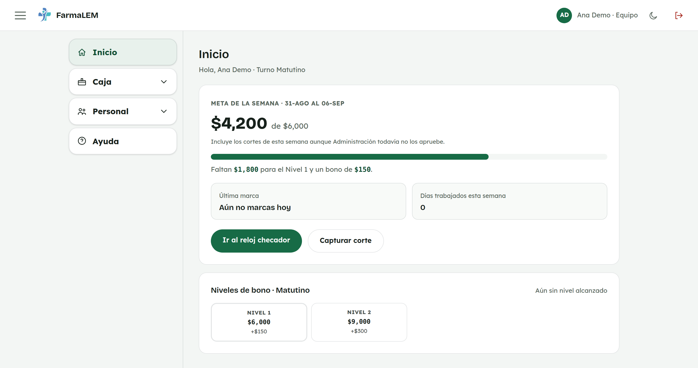
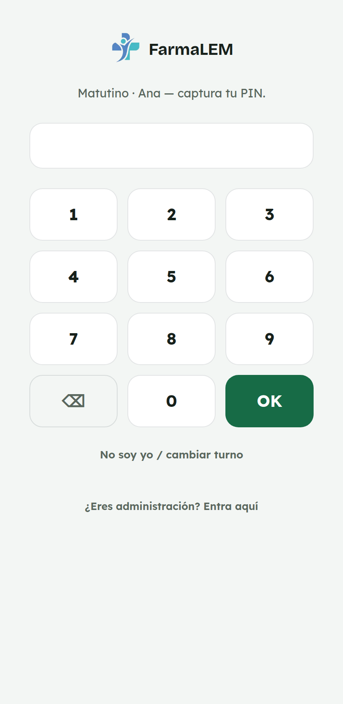
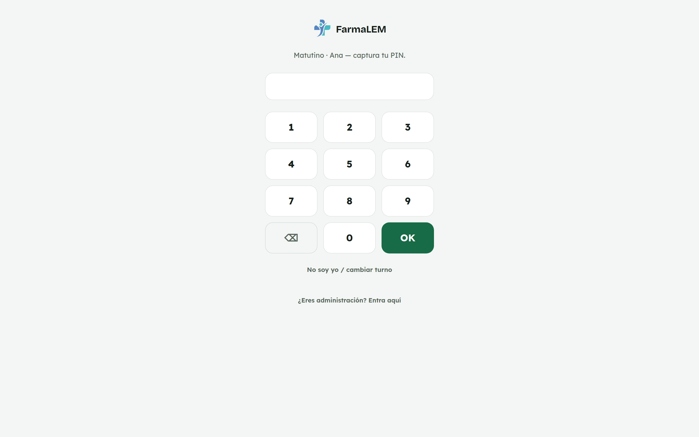
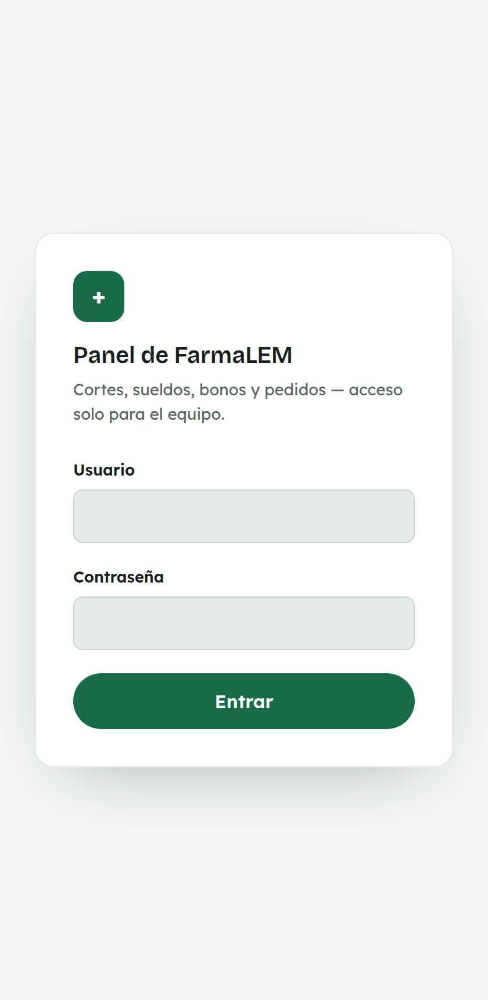
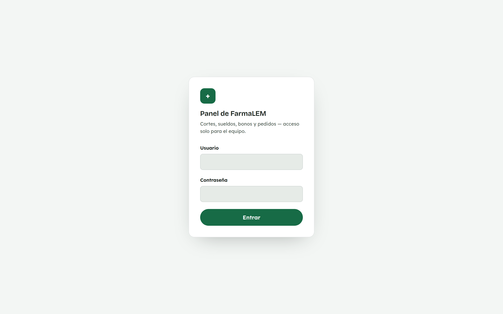

# 1. Cómo entrar al panel

**Para quién:** todo el equipo (mostrador y administración).
**Cuánto tarda:** menos de un minuto.

> Este tutorial empieza **después** de que ya está creado el acceso directo en
> la pantalla de la computadora del mostrador. Si en tu equipo todavía no está,
> pídelo a administración.

> **Nota:** las capturas de esta guía se hicieron con dos empleadas de
> ejemplo (**Ana Demo** y **Luis Demo**) en una copia de prueba de la app —
> no son cuentas reales. Tu pantalla se va a ver igual, solo que con tu
> nombre y el de tus compañeras.

---

## Paso 1 — Abre el acceso directo

Toca el ícono de **FarmaLEM** en la pantalla de inicio de la computadora del
mostrador. Se abre directo en la pantalla para elegir tu turno.

*En la computadora del mostrador se ve igual, solo más grande:*

Cada botón muestra el nombre de quien está asignado a ese turno. Toca el
tuyo — por ejemplo, **MATUTINO**.

## Paso 2 — La primera vez: tu contraseña

La primera vez que entras desde esa computadora, te pide tu **contraseña**
completa (la misma de siempre). Esto es solo para que esa computadora
"aprenda" que tú marcas ese turno.

*En computadora:*

Escribe tu contraseña y toca **Entrar**.

## Paso 3 — Llegas a Inicio

Ahí ves tu meta de ventas de la semana, tu última marca del reloj checador y
accesos directos a lo que más usas.

*En computadora:*

Desde aquí puedes ir directo al [reloj checador](02-reloj-checador.md) o a
[capturar el corte del día](03-capturar-corte-del-dia.md).

---

## La próxima vez: solo tu PIN

Esa misma computadora ya "reconoce" tu turno después de la primera vez. En
vez de pedirte la contraseña completa, solo te pide tu **PIN corto** (el
mismo de 4 a 6 dígitos que usas para todo lo demás en el mostrador).

*En computadora:*

Marca tu PIN y toca **OK**. Si el PIN se te olvida, pídele a administración
que te asigne uno nuevo desde **Empleados**.

> Si en esa computadora aparece otra persona o quieres volver a elegir turno,
> toca **"No soy yo / cambiar turno"**, debajo del teclado.

---

## ¿Eres administración?

Ese acceso no cambió: usuario y contraseña de siempre, desde el enlace
**"¿Eres administración? Entra aquí"** que está debajo de los botones de
turno.

*En computadora:*

---

## Cerrar sesión

El botón de salir (la flechita roja, arriba a la derecha, dentro del panel)
cierra tu sesión y te regresa a la pantalla de turno.

> **Ojo con la computadora del mostrador:** si es el equipo que usa todo el
> equipo para entrar y marcar, **no cierres sesión** al terminar tu turno —
> solo toca **"Cambiar de turno"** (lo ves en el reloj checador) para que la
> siguiente persona pueda entrar con su turno. Cerrar sesión del todo solo
> hace falta en tu celular o en equipos personales.

## No te pide tu PIN cada vez

Tu sesión queda guardada 30 días en esa computadora. Mientras tanto, si
alguien más ya usó "Cambiar de turno" y eliges el tuyo, solo te pide el PIN
(no la contraseña) — así de rápido es entrar todos los días.

---

## Si algo no sale

| Lo que ves | Qué significa | Qué hacer |
|---|---|---|
| **"Contraseña incorrecta."** | Te equivocaste al escribir. | Vuelve a intentar despacio, revisando mayúsculas. |
| **"PIN incorrecto."** | El PIN no coincide con el de esa persona. | Inténtalo de nuevo. Si sigue igual, pide a administración que te revise el PIN. |
| **"Esta computadora ya no está reconocida para este turno — entra con tu usuario y contraseña."** | Se venció o se borró el "reconocimiento" de esa computadora. | Toca "No soy yo / cambiar turno" y vuelve a entrar con tu contraseña completa. |
| **"No hay nadie asignado a ese turno todavía."** | Tu turno no tiene a nadie activo en **Empleados**. | Avisa a administración. |
| La pantalla se queda en blanco o no carga | Se cayó el internet del local. | Revisa el wifi o los datos y vuelve a abrir el acceso directo. |

Cualquier otra cosa rara: toma una foto de la pantalla y mándala a
administración. Con la foto se arregla mucho más rápido.

---

## Para administración

### Asignar el turno y la contraseña de alguien

Cada turno (Matutino/Vespertino) solo puede tener **una persona activa** al
mismo tiempo — si hay dos personas activas en el mismo turno, la pantalla de
turno no puede decidir a quién le toca y ese botón queda deshabilitado. Para
cambiar quién cubre un turno, ve a **Personal → Empleados** y ajusta el turno
de cada quien ahí.

### Si alguien cambia de contraseña o de computadora

El "reconocimiento" de una computadora (para no pedir la contraseña cada
vez) es por turno y por navegador. Si alguien usa una computadora nueva, o si
le cambias la contraseña, la próxima vez que entre en esa computadora le va a
pedir la contraseña completa otra vez — es normal, no significa que algo se
rompió.
