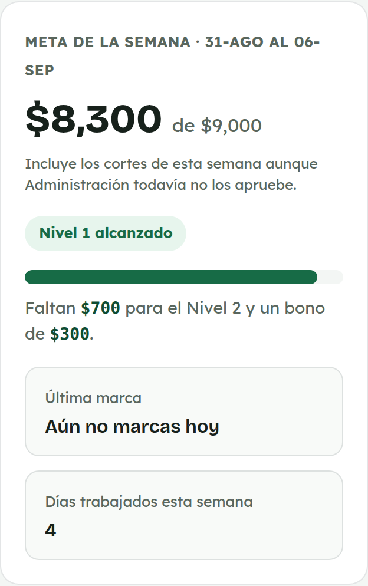
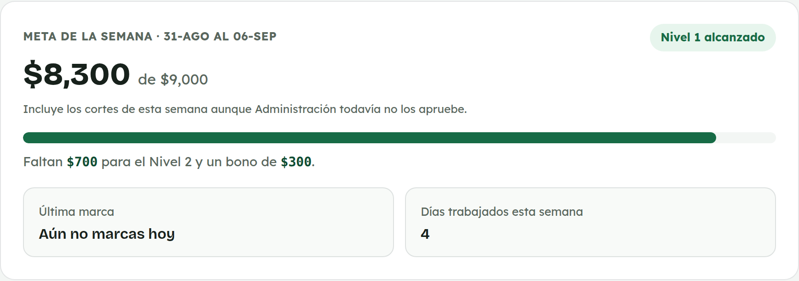
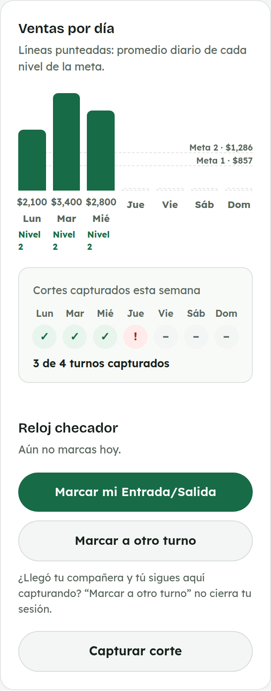
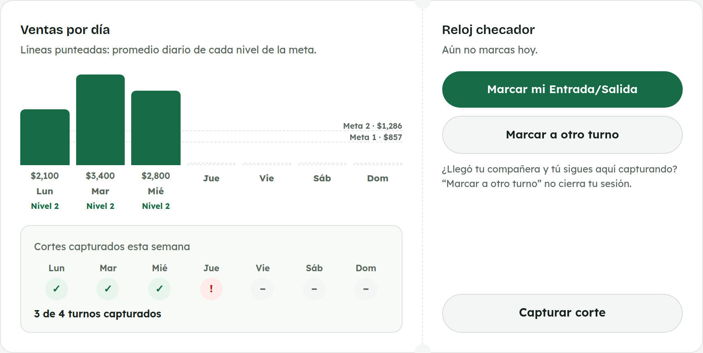
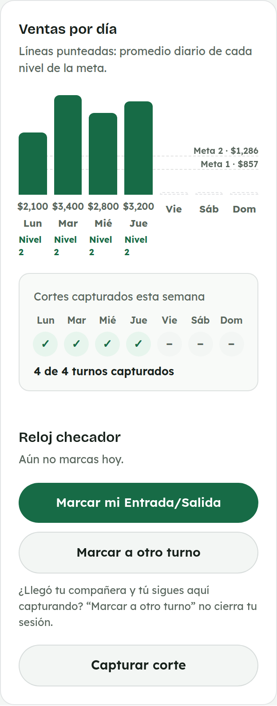
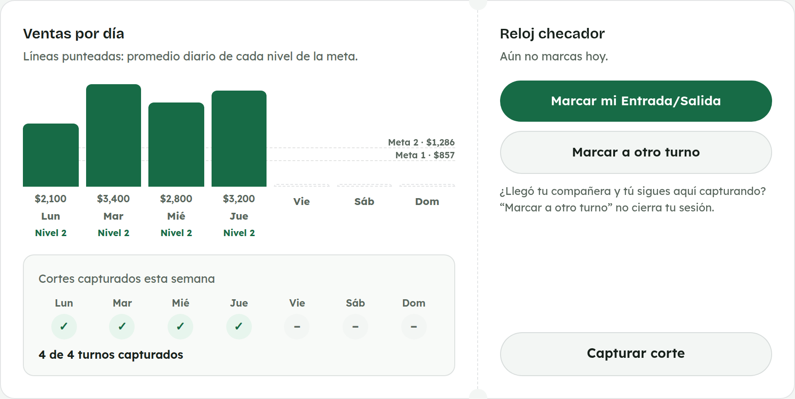
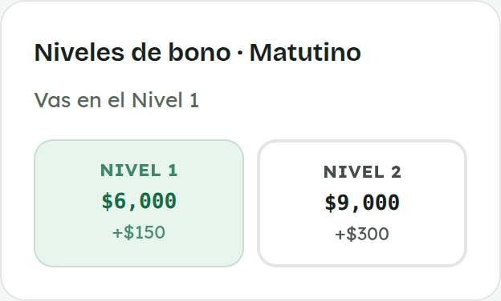
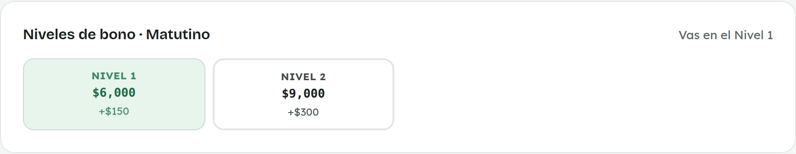

# 2. Cómo usar Inicio

**Para quién:** equipo de mostrador.
**Cuánto tarda:** dos minutos.

> Este tutorial empieza **después** de que ya entraste al panel (ver
> [tutorial 1](01-como-entrar-al-panel.md)). **Inicio** es la primera
> pantalla que ves al entrar — aquí se explica cada parte y para qué sirve.

> **Nota:** las capturas de esta guía se hicieron con una empleada de
> ejemplo (**Ana Demo**) en una copia de prueba de la app — no son datos
> reales. Tu pantalla se va a ver igual, solo que con tus propios números.

---

## Meta de la semana

Arriba de todo ves cuánto llevas vendido esta semana (de lunes a domingo)
contra la meta, incluyendo los cortes que ya capturaste aunque
administración todavía no los apruebe. Debajo, tu última marca del reloj
checador y cuántos días has trabajado esta semana.

*En la computadora del mostrador:*

## Ventas por día y racha de cortes

La gráfica muestra cuánto vendiste cada día y las líneas punteadas son el
promedio diario que necesitas para alcanzar cada nivel de bono.

Debajo, **"Cortes capturados esta semana"** te dice de un vistazo qué días
ya quedaron registrados:

- ✓ verde = ese turno ya tiene su corte capturado.
- **!** rojo = ese turno ya se trabajó pero todavía no tiene corte — hace
  falta capturarlo.
- **–** gris = todavía no llega ese día.

*En computadora:*

Justo debajo está el **reloj checador** (para marcar tu entrada/salida, o
[marcar a otro turno](03-reloj-checador.md#marcar-a-otro-turno)) y el botón
**"Capturar corte"**.

En cuanto guardas el [corte del día](04-capturar-corte-del-dia.md), su
casilla en la racha cambia a palomita verde de inmediato — así confirmas que
ya quedó, sin tener que ir a la lista de **Cortes** a revisar.

*En computadora:*

## Niveles de bono

Aquí ves los dos niveles de bono de tu turno: cuánto hay que vender en la
semana para alcanzar cada uno y cuánto es el bono. **"Vas en el Nivel…"** te
dice dónde estás parada ahora mismo con lo que llevas vendido.

*En computadora:*

---

## Si algo no sale

| Lo que ves | Qué significa | Qué hacer |
|---|---|---|
| Un turno marcado con **"!"** que ya trabajaste | Ese día todavía no tiene corte capturado. | Ve a "Capturar corte" y captúralo — la racha se actualiza sola al guardar. |
| La meta o la gráfica no cuadran con lo que recuerdas | Puede que falte aprobar o corregir algún corte. | Revisa la lista de **Cortes** o avisa a administración. |

---

## Para administración

Administración ve una pantalla de Inicio distinta (con reportes generales en
vez de la meta personal), así que este tutorial es solo para el equipo de
mostrador.
