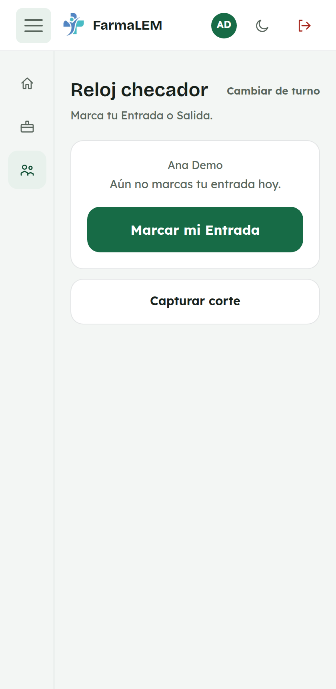
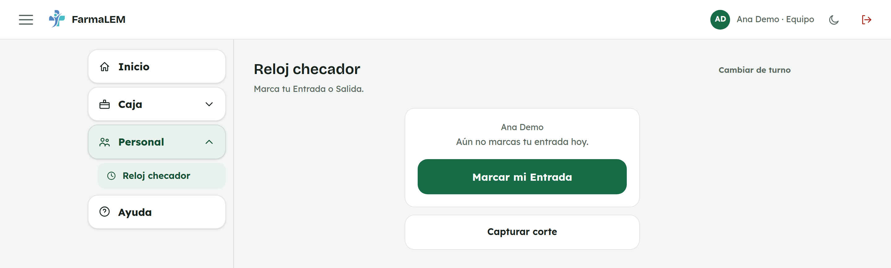
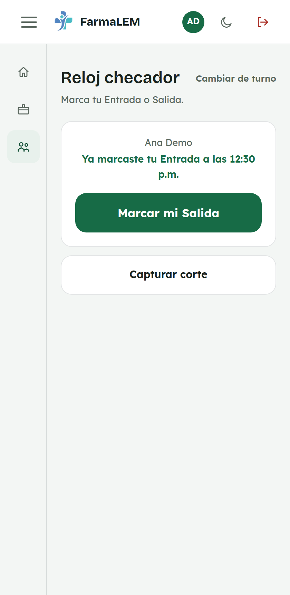
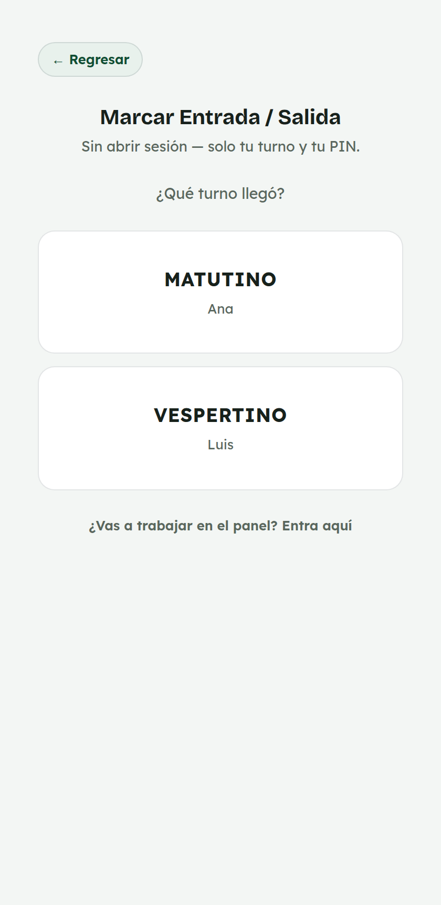
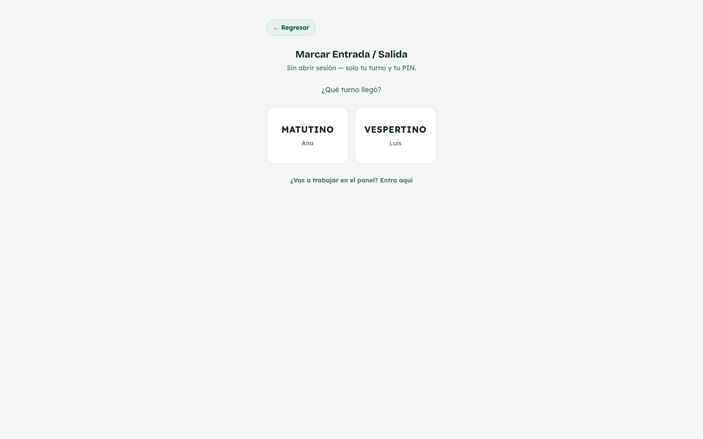
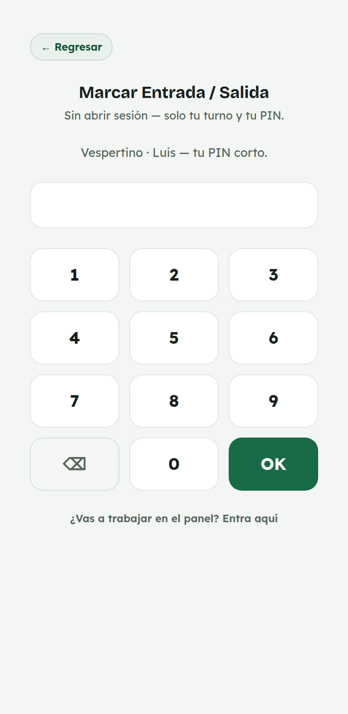
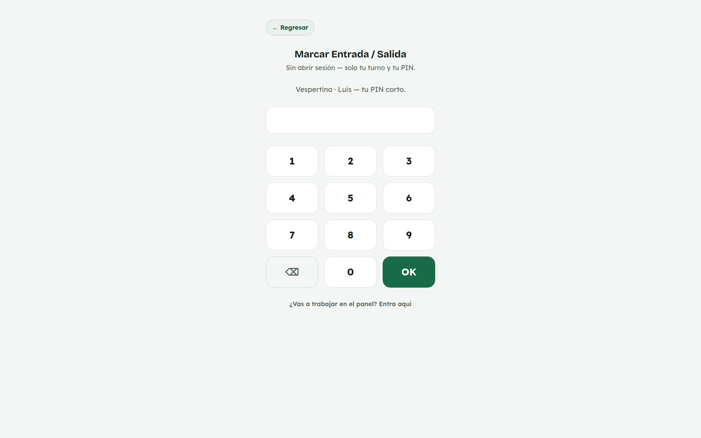
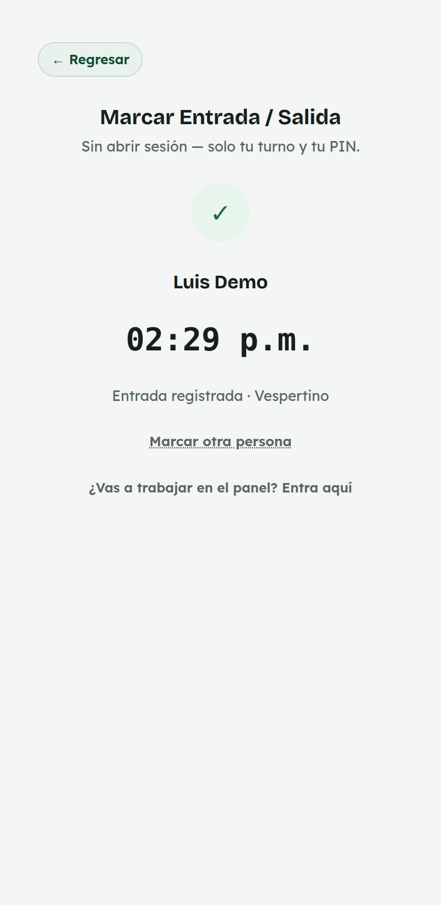
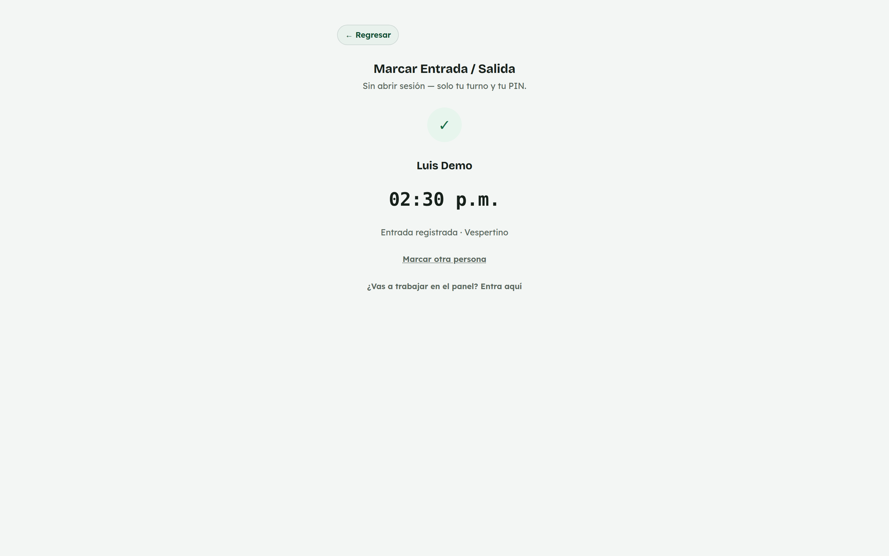

# 3. Cómo usar el reloj checador

**Para quién:** todo el equipo de mostrador.
**Cuándo:** al llegar a tu turno y al terminarlo.
**Cuánto tarda:** un toque.

> Este tutorial empieza **después** de que ya entraste al panel eligiendo tu
> turno (ver [tutorial 1](01-como-entrar-al-panel.md)). Ya no hace falta
> capturar ningún PIN aparte para marcar: el que usaste para entrar es
> suficiente.

---

## Paso 1 — Entra al reloj checador

Desde **Inicio**, toca **"Ir al reloj checador"**. O, en el menú ☰,
**Personal → Reloj checador**.

*En la computadora del mostrador:*

La pantalla te dice claramente si ya marcaste hoy o no. El botón siempre
dice qué vas a marcar a continuación — no tienes que elegir nada.

## Paso 2 — Marca tu entrada

Toca el botón verde. En este caso dice **"Marcar mi Entrada"**.

*En computadora:*

La pantalla confirma tu nombre y la **hora exacta**. El botón cambia solo a
**"Marcar mi Salida"**, listo para cuando termines tu turno.

Al marcar tu Entrada, tu asistencia del día queda registrada automáticamente
como **"Asistió"** — no hace falta que nadie la capture aparte en Asistencia.

## Paso 3 — Al terminar tu turno: marca tu salida

Mismo botón, mismo lugar.

*En computadora:*

**No te vayas sin marcarla.** Si no marcas tu salida, tu horario del día
queda incompleto en los reportes, aunque tu asistencia ya haya quedado bien
por la entrada.

---

## Cambiar de turno en la misma computadora

Si la siguiente persona va a usar esa misma computadora, toca **"Cambiar de
turno"** (arriba, junto al título "Reloj checador"). Eso cierra tu sesión y
regresa a la pantalla para elegir turno — la siguiente persona solo necesita
su PIN.

## Marcar a otro turno

¿Llegó tu compañera y tú sigues en el mostrador capturando algo? No hace
falta cerrar tu sesión para que ella marque su entrada. Desde **Inicio** (o
desde el enlace ["¿Ya llegaste pero aún no puedes
entrar?"](01-como-entrar-al-panel.md) en la pantalla de turno) hay un botón
**"Marcar a otro turno"**. Sirve para marcar la entrada o salida de alguien
más sin tocar tu propia sesión.

Primero pide qué turno llegó:

*En computadora:*

Después, igual que en el reloj checador normal, solo pide el **PIN corto**
de esa persona — no su contraseña ni la tuya.

*En computadora:*

Confirma su nombre, la hora y si quedó como entrada o salida.

*En computadora:*

**"Marcar otra persona"** te regresa a elegir turno por si hace falta marcar
a alguien más; **"Regresar"** te lleva de vuelta a la pantalla de turno sin
afectar tu sesión.

## Si algo no sale

| Lo que ves | Qué significa | Qué hacer |
|---|---|---|
| **"No se pudo registrar."** | Se cayó el internet o la conexión con el sistema. | Espera unos segundos y vuelve a intentar. Si no pasa, anota tu hora en papel y avisa a administración para que la capture. |
| Marcaste dos veces sin querer | Quedó una Entrada y una Salida seguidas de más. | Avisa a administración: lo ve en la bitácora y lo corrige. |
| Te manda a la pantalla de turno | Se cerró tu sesión (o alguien tocó "Cambiar de turno"). | Vuelve a entrar con tu turno y tu PIN. |

---

## Para administración

### Revisar la bitácora del día

Menú ☰ → **Personal** → **Reloj checador** (como administración ves reportes
en vez del botón de marcar) → **"Bitácora del reloj checador"**.

Muestra, para el día que elijas, cada Entrada y Salida marcada, con hora y
nombre. Cada marca también queda en **Historial** como
*"Reloj checador · Entrada"* / *"Reloj checador · Salida"*.

### Reporte semanal de entradas

Menú ☰ → **Personal** → **Reloj checador** → **"Reporte semanal de
entradas"**, útil para cruzar contra Sueldos.

### Asignar o cambiar el PIN de alguien

Ve a **Personal → Empleados**, abre a la persona y llena el campo del **PIN
del reloj checador (4 a 6 dígitos)**. Deja el campo vacío si no quieres
cambiarlo al guardar otros datos del empleado.
