# 4. Cómo capturar el corte del día

**Para quién:** todo el equipo de mostrador.
**Cuándo:** al terminar tu turno, con la venta del día y el efectivo listos.
**Cuánto tarda:** dos o tres minutos.

> Este tutorial empieza **después** de que ya entraste al panel (ver
> [tutorial 1](01-como-entrar-al-panel.md)). Necesitas a la mano: el total de
> venta del día, cuánto fue con tarjeta/transferencia, y el efectivo ya
> contado por billete y moneda.

---

## Paso 1 — Entra a Capturar corte

Desde **Inicio** o desde el **Reloj checador**, toca **"Capturar corte"**.
O, en el menú ☰, **Caja → Cortes → "+ Capturar corte"**.

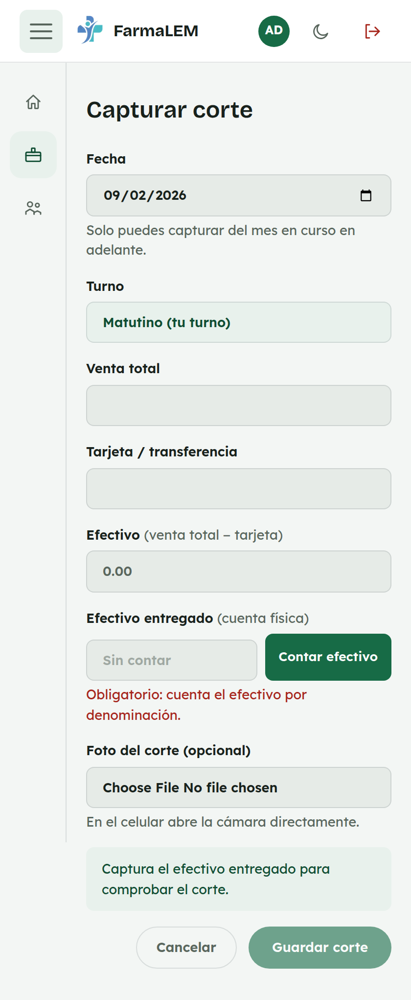

*En la computadora del mostrador:*

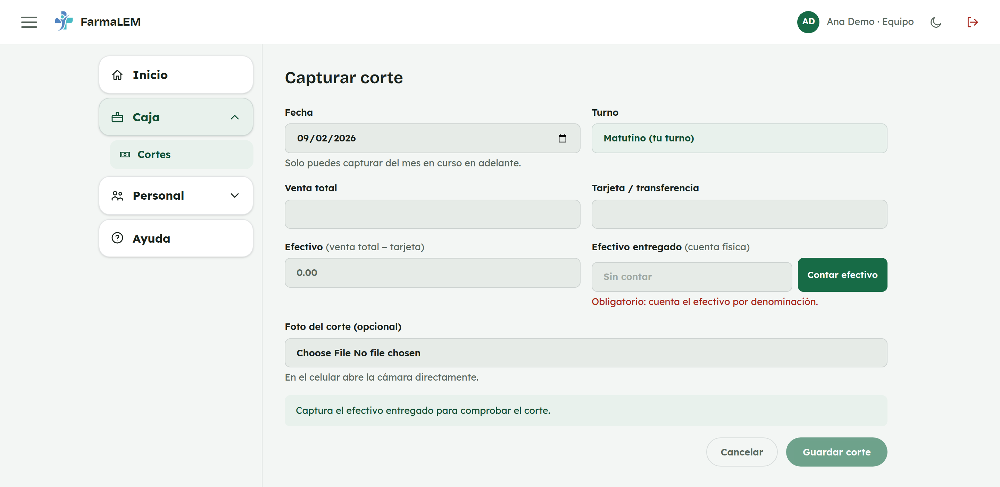

La **fecha** ya viene en hoy y tu **turno** ya viene puesto — como empleada
no necesitas elegir turno, ya sabe cuál es el tuyo.

## Paso 2 — Captura la venta total y lo que fue con tarjeta

Escribe la **Venta total** del día y cuánto de eso fue con **Tarjeta /
transferencia**.

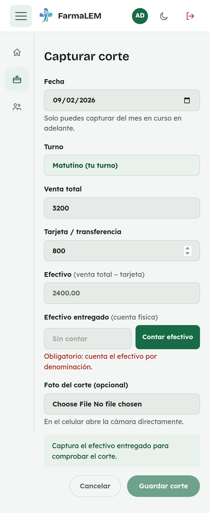

*En computadora:*

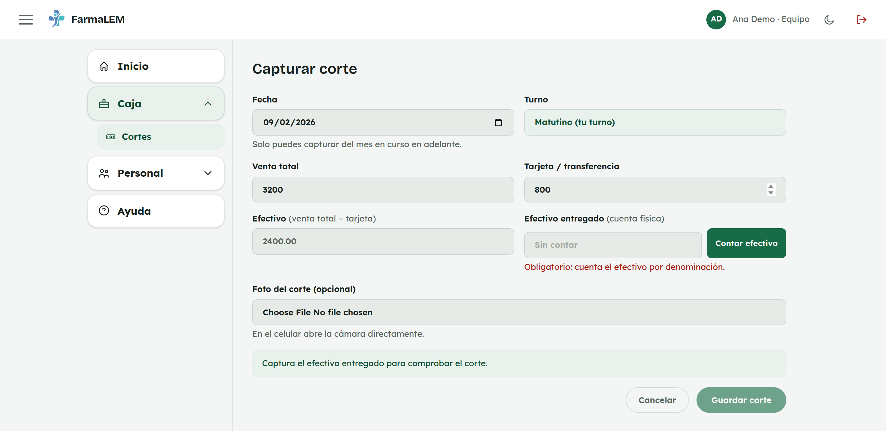

El campo **Efectivo** se calcula solo (venta total menos tarjeta) — no lo
tienes que llenar tú.

## Paso 3 — Cuenta el efectivo por denominación

Toca **"Contar efectivo"**. Se abre una ventana para capturar cuántos
billetes y monedas de cada denominación trae el sobre.

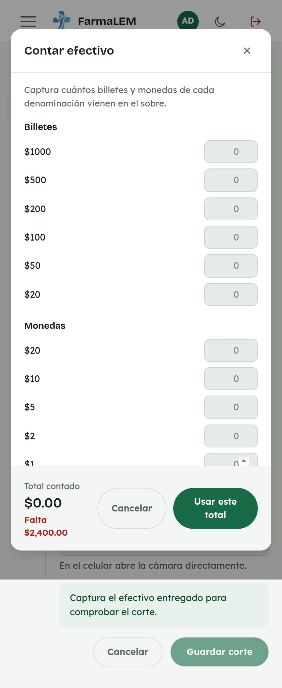

*En computadora:*

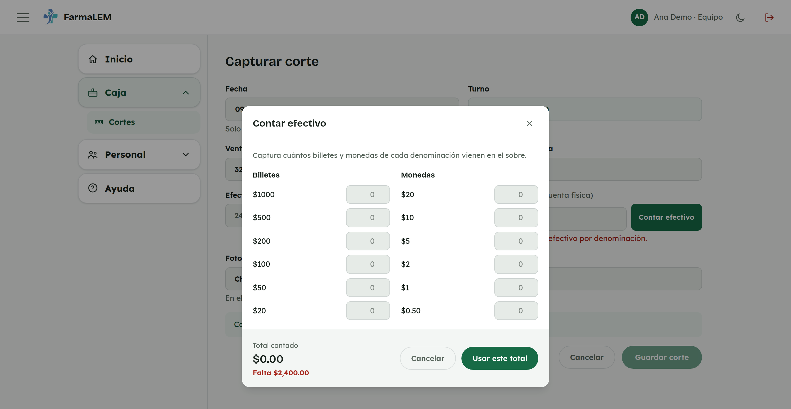

Cuenta el efectivo físico y captura cuántos hay de cada uno.

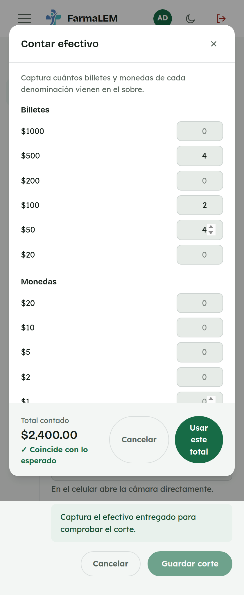

*En computadora:*

Abajo ves el **total contado** y si coincide con lo que se esperaba (venta
en efectivo, o menos la nómina si la pagaste de esa venta). Cuando esté
correcto, toca **"Usar este total"**.

> **Este paso es obligatorio.** El botón para guardar el corte no se activa
> hasta que cuentes el efectivo aquí — así el corte siempre queda respaldado
> con el desglose real, no solo con un número escrito a ojo.

## Paso 4 — Revisa y guarda

De vuelta en el formulario, el campo **Efectivo entregado** ya viene lleno
con lo que contaste, y el aviso de abajo confirma que coincide.

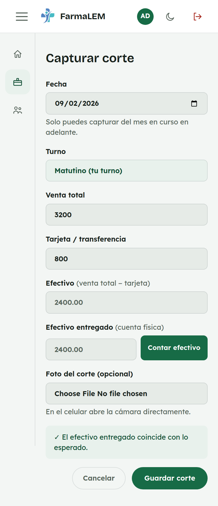

*En computadora:*

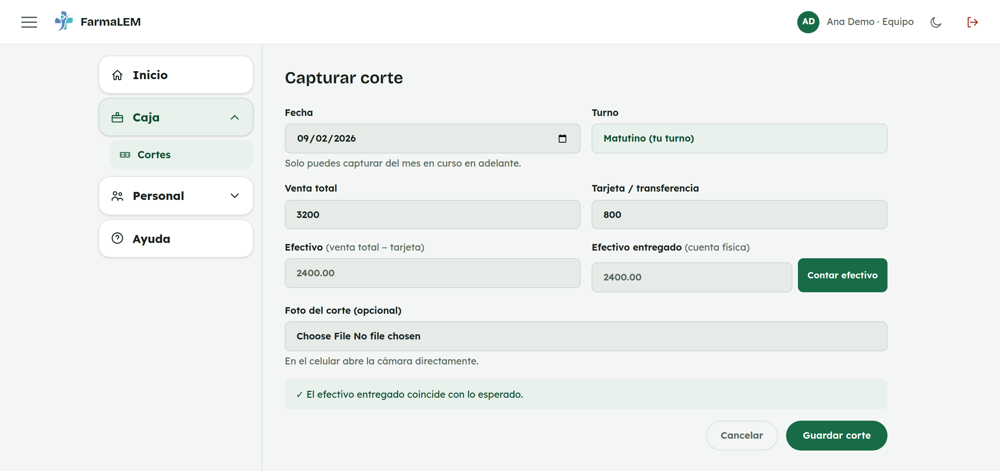

Si quieres, adjunta una foto del corte en **"Foto del corte (opcional)"** —
en el celular abre la cámara directo. Cuando todo esté correcto, toca
**"Guardar corte"**.

## Listo

Al guardar verás **"✓ Corte guardado correctamente."** arriba de la lista.
Tu corte queda guardado en **Cortes**, con estado **"Por revisar"** hasta que
administración lo apruebe.

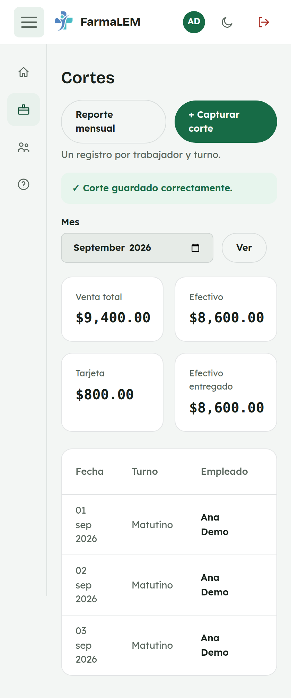

*En computadora:*

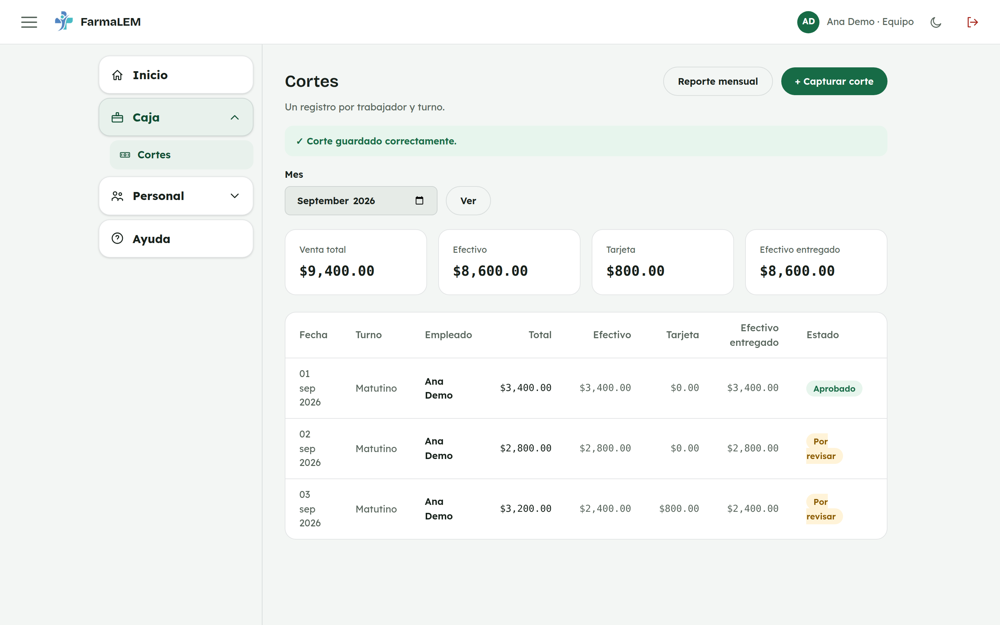

---

## Si la pantalla se recarga a medio capturar

No pierdes lo que ya escribiste: FarmaLEM guarda un borrador en tu celular o
computadora mientras capturas. Si la página se llega a recargar sola (por
ejemplo por una actualización del panel), al volver a abrir **"Capturar
corte"** verás el aviso **"Recuperamos lo que tenías escrito de un intento
anterior — revísalo antes de guardar."** con tus datos ya puestos. Solo
revísalo antes de guardar, por si algo quedó a medias.

---

## Sobre el pago de nómina (fines de semana)

Si ese día se pagó la nómina de la semana desde este mismo corte, verás un
campo extra, **"Pago de nómina de esta semana"** — solo aparece los fines de
semana. Lo que captures ahí se resta del efectivo esperado y queda
registrado como salida de nómina; no hace falta capturarlo aparte en otro
lado.

## Si algo no sale

| Lo que ves | Qué significa | Qué hacer |
|---|---|---|
| **"Efectivo + tarjeta debe ser igual a la venta total."** | La tarjeta es mayor que la venta total, o los números no cuadran. | Revisa que Tarjeta no sea mayor que Venta total. |
| El botón "Guardar corte" está apagado | Todavía no contaste el efectivo. | Toca "Contar efectivo" y termina ese paso. |
| **"Falta $___"** o **"Sobra $___"** en el conteo | El efectivo contado no coincide con lo esperado. | Vuelve a contar. Si de plano no cuadra, guarda el corte igual con el total real — administración lo revisa. |
| **"Ya existe un corte capturado para esa fecha y ese turno."** | Ese día y turno ya tienen un corte guardado. | Si te equivocaste, pide a administración que lo edite; no se puede capturar dos veces el mismo día y turno. |
| **"Ya no puedes capturar un corte de un mes anterior — pídele a administración que lo agregue."** | Intentaste capturar una fecha de un mes ya cerrado. | Pide a administración que lo agregue desde su acceso. |

---

## Para administración

### Aprobar o revisar cortes

En **Caja → Cortes** ves todos los cortes del mes, con totales de venta,
efectivo, tarjeta y efectivo entregado. Los que capturó el equipo llegan como
**"Por revisar"**; los que captura administración quedan **"Aprobados"**
directo. Ahí mismo puedes editar fecha, turno, empleado, montos o estado si
hace falta corregir algo.

### Reporte mensual

El botón **"Reporte mensual"** (arriba de la lista) abre una vista para
imprimir o compartir con el resumen del mes completo.
