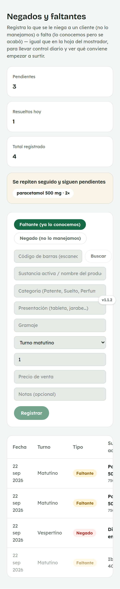
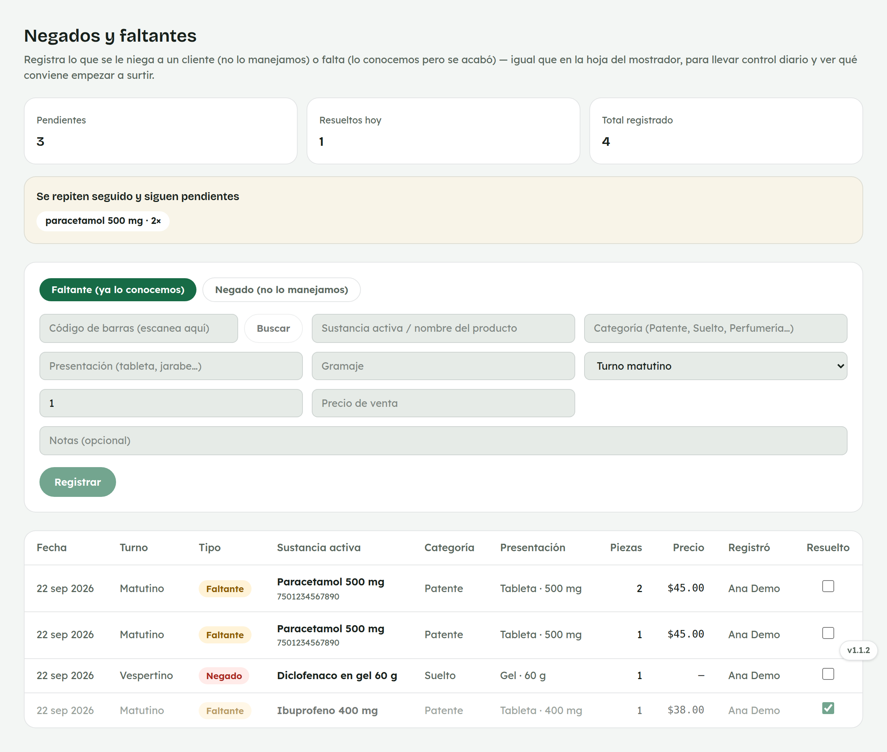
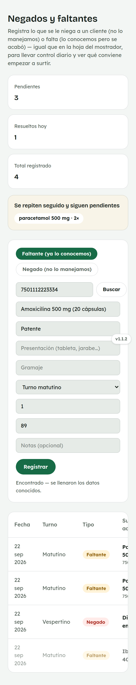
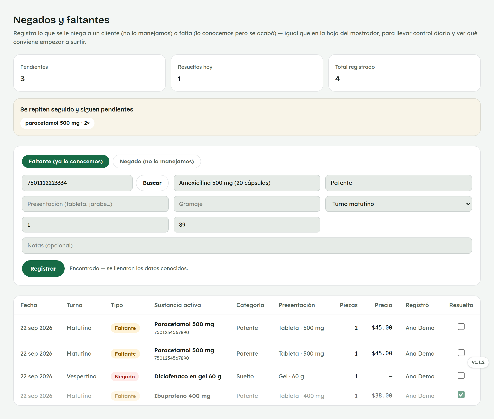
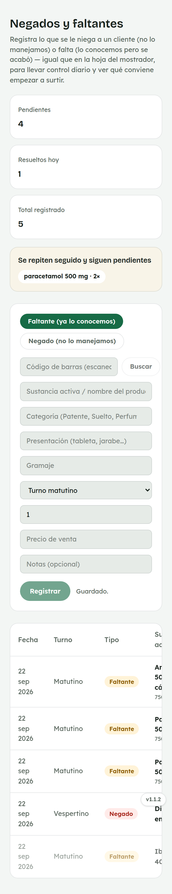
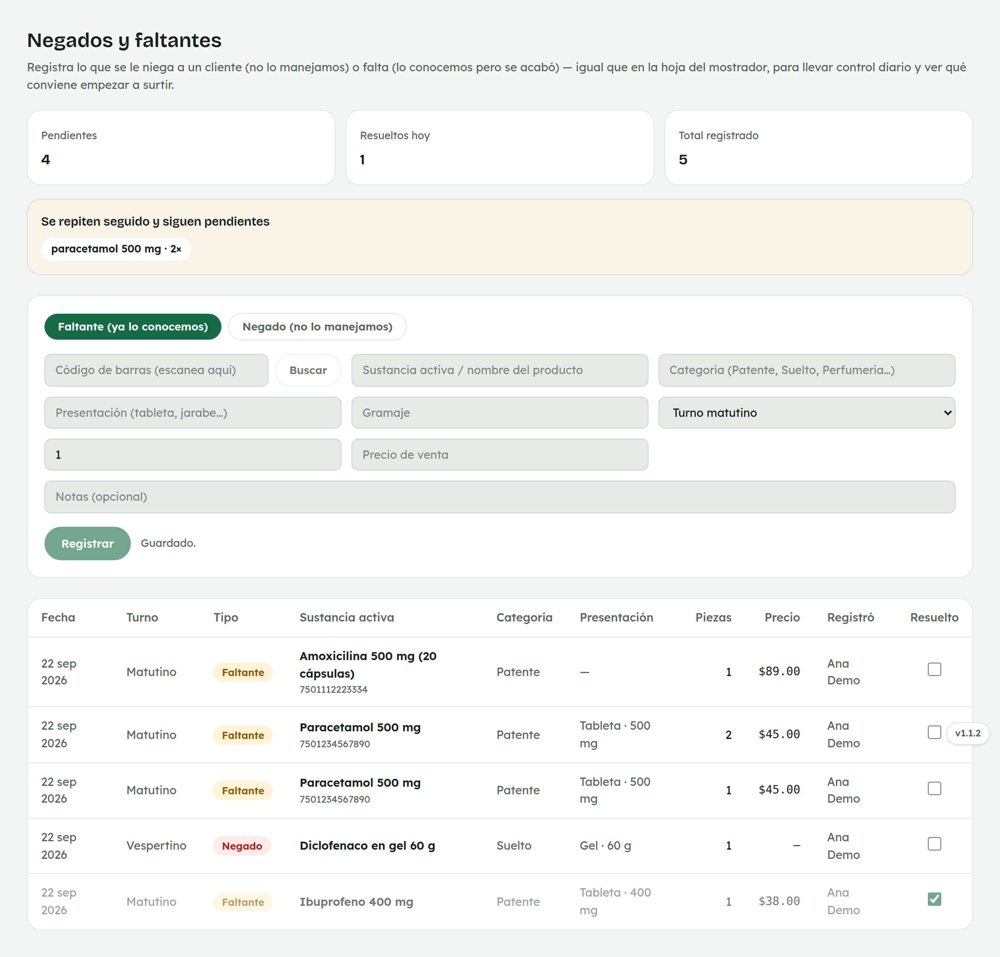
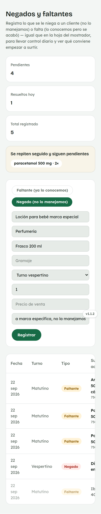
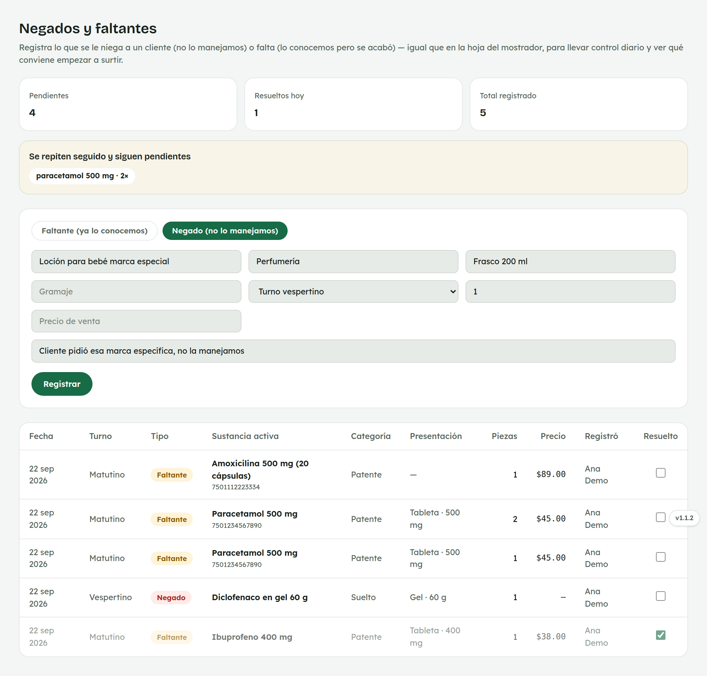
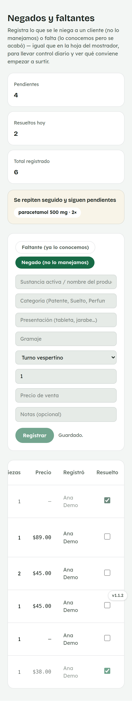
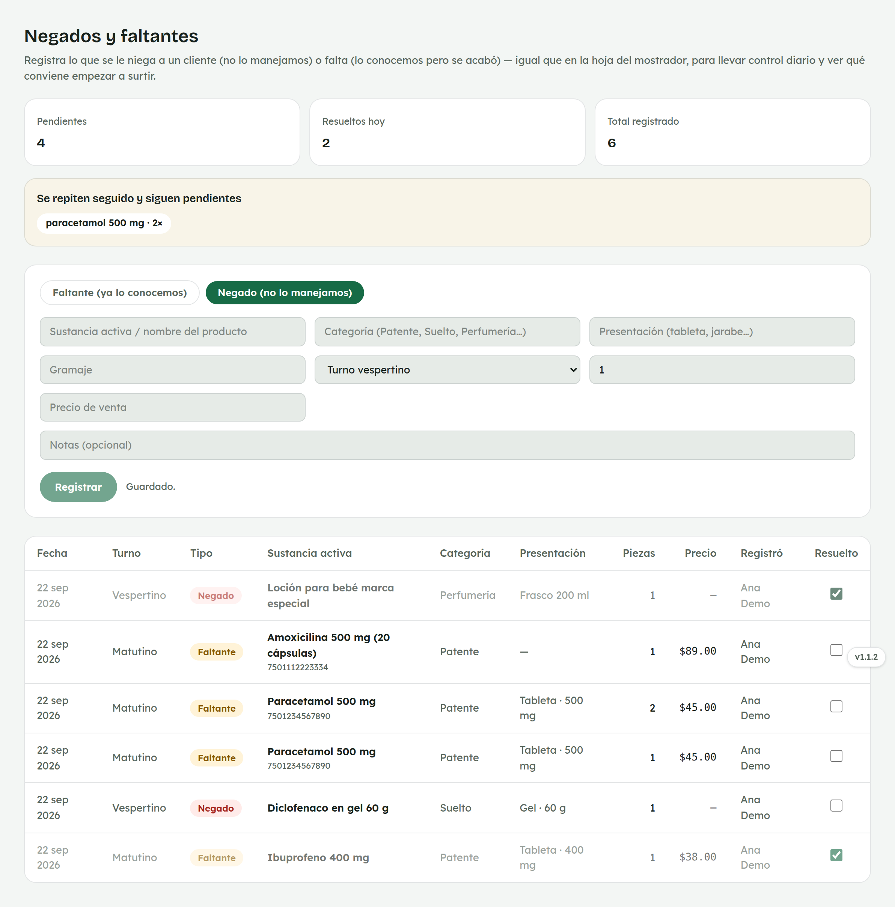

# 5. Cómo usar Negados y faltantes

**Para quién:** equipo de mostrador.
**Cuándo:** cada vez que a un cliente se le niega un producto o falta algo que ya conocemos.
**Cuánto tarda:** medio minuto por registro.

> Este tutorial empieza **después** de que ya entraste al panel (ver
> [tutorial 1](01-como-entrar-al-panel.md)). Es lo mismo que llevar la hoja
> de papel del mostrador, pero en el panel — para tener un control diario y
> que administración vea qué conviene empezar a surtir.

> **Nota:** las capturas de esta guía se hicieron con una empleada de
> ejemplo (**Ana Demo**) en una copia de prueba de la app — no son datos
> reales.

---

## Paso 1 — Entra a Negados y faltantes

Menú ☰ → **Mercancía** → **"Negados y faltantes"**.

*En la computadora del mostrador:*

Arriba ves cuántos quedan **pendientes**, cuántos se **resolvieron hoy** y el
**total registrado**. Si una misma sustancia se repite varias veces y sigue
pendiente, aparece en un aviso aparte — es una señal de que conviene
surtirla pronto.

Debajo está el formulario, con dos botones:

- **Faltante (ya lo conocemos)** — un producto que sí manejamos, pero se
  acabó.
- **Negado (no lo manejamos)** — algo que un cliente pidió y no manejamos en
  la farmacia.

## Paso 2 — Faltante: escanea el código de barras

Si el producto tiene código de barras, escanéalo (o cópialo) en el primer
campo y toca **"Buscar"**.

*En computadora:*

Si ese código ya se ha comprado antes o está en el catálogo de referencia,
se autocompletan la **sustancia activa**, la **categoría** y el **precio de
venta** — solo revisa que esté bien y ajusta la **cantidad**. Si el código
no se encuentra, el aviso te dice que lo captures a mano.

## Paso 3 — Registrar

Con la sustancia activa capturada (a mano o autocompletada) y la cantidad
correcta, toca **"Registrar"**.

*En computadora:*

Verás **"Guardado."**, el formulario se limpia solo y el nuevo registro
aparece arriba de la lista.

> El botón **"Registrar"** no se activa hasta que escribas la sustancia
> activa / nombre del producto.

## Paso 4 — Negado: cuando no lo manejamos

Cambia a **"Negado"**, escribe el nombre de lo que pidió el cliente,
categoría y presentación si las sabes, y anota en **"Notas"** cualquier
detalle (una marca específica, por ejemplo).

*En computadora:*

No hay código de barras que buscar aquí, porque no es un producto que
manejemos.

## Paso 5 — Márcalo "Resuelto" en cuanto se surta

En la columna **"Resuelto"**, al final de cada fila, hay una casilla —
actívala en cuanto ese producto vuelva a estar disponible.

*En computadora:*

Si el "Faltante" tenía código de barras, se marca **solo** como resuelto en
cuanto llegue en una recepción de mercancía con ese mismo código — no hace
falta que nadie se acuerde de marcarlo a mano.

> **En el celular:** la tabla es ancha — desliza hacia los lados para ver la
> columna "Resuelto" si no la ves de entrada.

---

## Si algo no sale

| Lo que ves | Qué significa | Qué hacer |
|---|---|---|
| El botón "Registrar" está apagado | Falta escribir la sustancia activa / nombre del producto. | Escríbelo y el botón se activa solo. |
| "Ese código no está en compras ni en el catálogo." | El código de barras no se encuentra. | Captúralo como Negado, o llena los datos a mano en modo Faltante. |
| No aparece "Negados y faltantes" en tu menú | Puede ser que tu computadora todavía tenga cargada una versión vieja del panel. | Cierra sesión y vuelve a entrar; si sigue sin aparecer, avisa a administración. |

---

## Para administración

### Categorías de Negados y faltantes

Las categorías que aparecen sugeridas al escribir (Patente, Suelto,
Perfumería…) se configuran en **Configuración**, y se pueden editar,
agregar o quitar ahí.

### Ver el costo

Administración ve una columna extra de **Costo** en la tabla, que el equipo
de mostrador no ve — igual que en Cortes.

### Borrar un registro

Solo administración puede borrar un registro de la lista, desde el botón al
final de cada fila.
