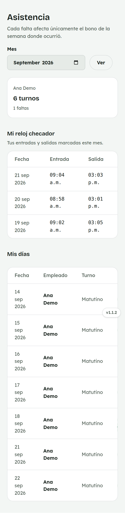
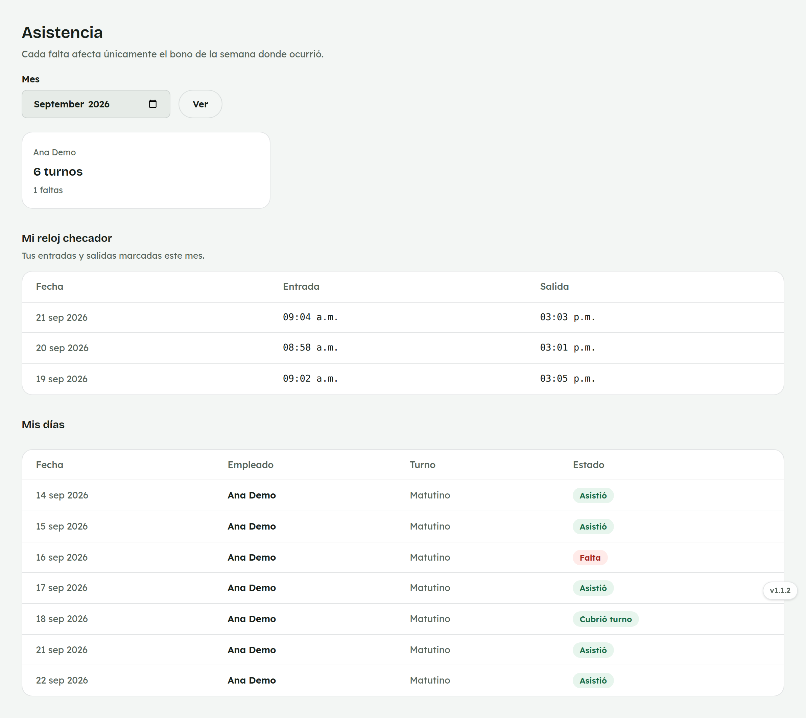

# 6. Cómo consultar tu Asistencia

**Para quién:** equipo de mostrador.
**Cuánto tarda:** medio minuto.

> Este tutorial empieza **después** de que ya entraste al panel (ver
> [tutorial 1](01-como-entrar-al-panel.md)). Es una pantalla de **solo
> lectura**: consultas tu propia asistencia, pero no la editas ni la de
> tus compañeras.

> **Nota:** las capturas de esta guía se hicieron con una empleada de
> ejemplo (**Ana Demo**) en una copia de prueba de la app — no son datos
> reales.

---

## Solo ves tu propia asistencia

Menú ☰ → **Personal** → **"Asistencia"**.

*En la computadora del mostrador:*

Arriba ves cuántos **turnos** llevas trabajados este mes y cuántas
**faltas**. Debajo, **"Mi reloj checador"** con las entradas y salidas del
mes — igual que en el [Reloj checador](03-reloj-checador.md).

Es de solo lectura: nunca ves la asistencia de tus compañeras, y no puedes
editarla ni borrarla tú misma.

## Mis días

Más abajo, **"Mis días"** lista cada día del mes con tu turno y tu estado
(Asistió, Falta, Cubrió turno…).

> **En el celular:** la tabla es ancha — desliza hacia los lados para ver
> la columna "Estado" con el color de cada día.

**Cada falta afecta únicamente el bono de la semana donde ocurrió** — no
las demás semanas del mes.

---

## Para administración

Administración ve la asistencia de todo el equipo, con reportes y la
opción de registrar o corregir un día a mano — eso no cambió con esta
actualización.
