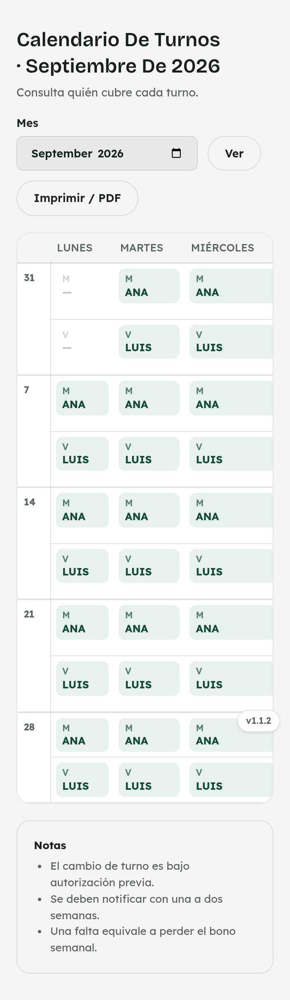
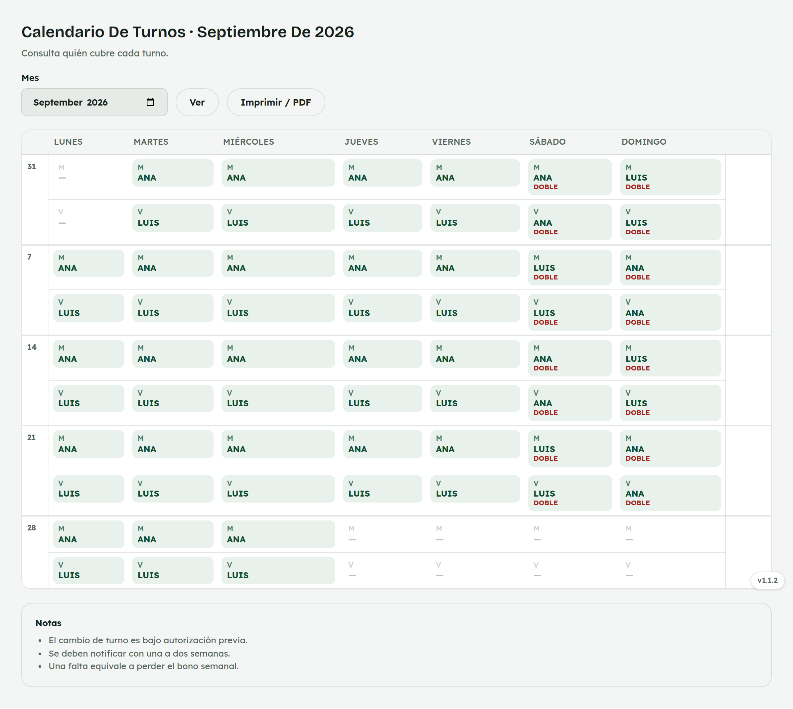

# 7. Cómo consultar el Calendario de turnos

**Para quién:** equipo de mostrador.
**Cuánto tarda:** medio minuto.

> Este tutorial empieza **después** de que ya entraste al panel (ver
> [tutorial 1](01-como-entrar-al-panel.md)).

> **Nota:** las capturas de esta guía se hicieron con empleados de ejemplo
> (**Ana Demo** y **Luis Demo**) en una copia de prueba de la app — no son
> datos reales.

---

## Consulta quién cubre cada turno

Menú ☰ → **Personal** → **"Calendario de turnos"**.

*En la computadora del mostrador (se ve la semana completa):*

> **En el celular:** la tabla es ancha — desliza hacia los lados para ver
> el resto de la semana (Jueves a Domingo).

Entre semana, cada quien cubre su turno fijo (Matutino o Vespertino). El
**fin de semana solo una persona dobla** el día completo (Matutino +
Vespertino), alternando cada fin de semana — se marca **"DOBLE"**.

## Si necesitas cambiar de turno con alguien

Las notas de abajo del calendario lo resumen:

- El cambio de turno es **bajo autorización previa**.
- Se debe **notificar con una a dos semanas** de anticipación.
- **Una falta equivale a perder el bono semanal** completo.

---

## Para administración

Administración puede tocar un turno para asignar quién lo cubre — eso
precarga el turno esperado en [Asistencia](06-asistencia.md) — y generar el
calendario del mes siguiente automáticamente desde el patrón vigente.
