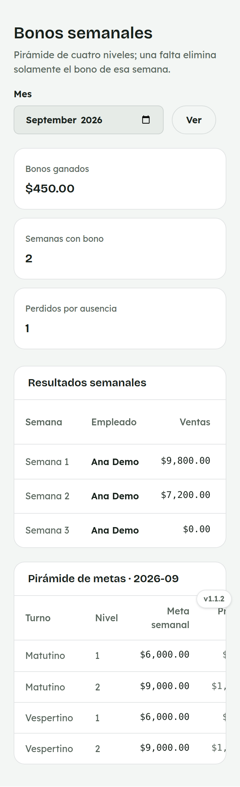
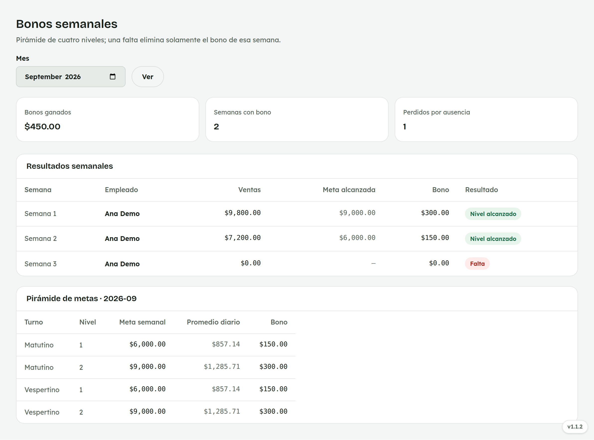

# 8. Cómo consultar tus Bonos semanales

**Para quién:** equipo de mostrador.
**Cuánto tarda:** medio minuto.

> Este tutorial empieza **después** de que ya entraste al panel (ver
> [tutorial 1](01-como-entrar-al-panel.md)). Es una pantalla de **solo
> lectura**: consultas tus propios bonos, calculados solos.

> **Nota:** las capturas de esta guía se hicieron con una empleada de
> ejemplo (**Ana Demo**) en una copia de prueba de la app — no son datos
> reales.

---

## Solo ves tus propias semanas

Menú ☰ → **Personal** → **"Bonos semanales"**.

*En la computadora del mostrador:*

Arriba ves cuánto llevas ganado en **bonos** este mes, en cuántas **semanas
con bono** alcanzaste algún nivel, y en cuántas lo **perdiste por
ausencia**.

Las semanas ya terminadas se calculan solas — nadie tiene que capturarlas a
mano.

## Pirámide de metas

Debajo de tus resultados semanales está la **pirámide de metas** del mes
para tu turno: cuánto hay que vender en la semana para cada nivel y cuánto
es el bono de cada uno.

---

## Si algo no sale

| Lo que ves | Qué significa | Qué hacer |
|---|---|---|
| Una semana no aparece todavía | Esa semana no ha terminado, o esa semana no tuvo ningún corte capturado. | Espera a que termine la semana; si ya terminó y sigue sin aparecer, avisa a administración. |
| Tu bono salió en $0 aunque vendiste | Puede que esa semana tenga una falta registrada — una falta elimina el bono de esa semana, aunque se haya alcanzado la meta en ventas. | Revisa tu [Asistencia](06-asistencia.md) de esa semana; si la falta está mal, avisa a administración. |

---

## Para administración

Administración ve los bonos de todo el equipo, puede configurar las metas
del mes y editar una semana a mano si hace falta corregir algo.
