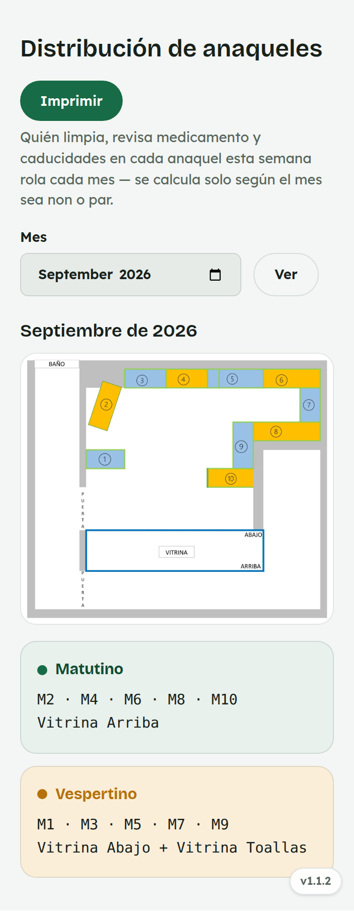
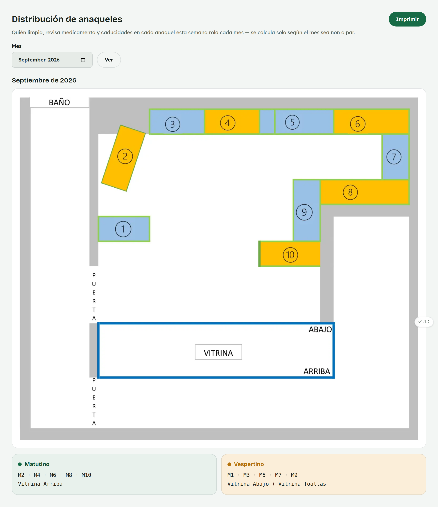

# 9. Cómo usar Distribución de anaqueles

**Para quién:** todo el equipo.
**Cuánto tarda:** medio minuto.

> Este tutorial empieza **después** de que ya entraste al panel (ver
> [tutorial 1](01-como-entrar-al-panel.md)).

---

## Quién limpia y revisa cada anaquel

Menú ☰ → **Personal** → **"Distribución de anaqueles"**.

*En la computadora del mostrador:*

El **croquis** muestra la numeración de cada anaquel dentro de la farmacia.
Debajo, cada turno (Matutino y Vespertino) ve qué números de anaquel y qué
vitrina le tocan limpiar, revisar medicamento y revisar caducidades **esta
semana**.

La asignación **rola sola cada mes** (según el mes sea non o par) — no hay
que acordarse ni configurarlo a mano.

---

## Para administración

Administración puede invertir la asignación del mes desde esta misma
pantalla, si por alguna razón conviene cambiar qué turno le toca cuál
grupo de anaqueles ese mes en particular.
