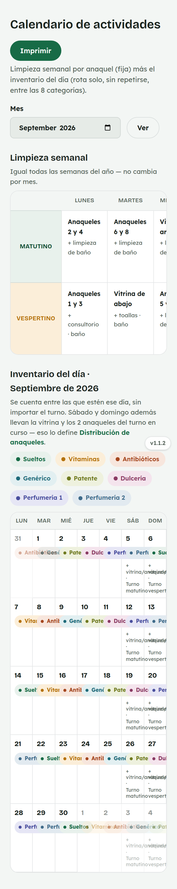
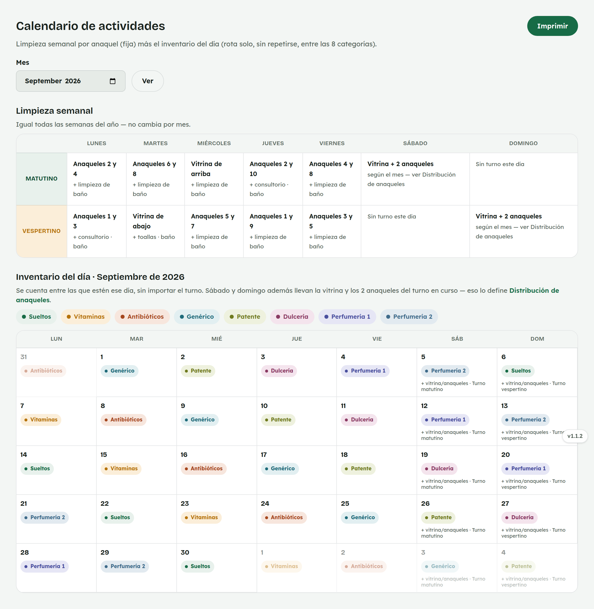

# 10. Cómo usar el Calendario de actividades

**Para quién:** todo el equipo.
**Cuánto tarda:** un minuto.

> Este tutorial empieza **después** de que ya entraste al panel (ver
> [tutorial 1](01-como-entrar-al-panel.md)).

---

## Limpieza semanal

Menú ☰ → **Personal** → **"Calendario de actividades"**.

*En la computadora del mostrador (se lee más cómodo el calendario
completo):*

La tabla de arriba, **"Limpieza semanal"**, es **igual todas las semanas
del año** — no cambia por mes. Dice qué anaqueles y qué más (baño,
consultorio, vitrina) le toca limpiar a cada turno, cada día de la semana.

## Inventario del día

Debajo, el calendario del mes reparte las **8 categorías de inventario**
(Sueltos, Vitaminas, Antibióticos, Genérico, Patente, Dulcería, Perfumería
1 y Perfumería 2) un día distinto cada vez, **sin repetirse**.

Se cuenta entre quien esté ese día, **sin importar el turno**. Sábado y
domingo además llevan la vitrina y los 2 anaqueles del turno en curso — eso
lo define [Distribución de anaqueles](09-anaqueles.md).

---

## Para administración

El botón **"Imprimir"** (arriba a la derecha) abre una vista para imprimir
o compartir el calendario del mes completo.
