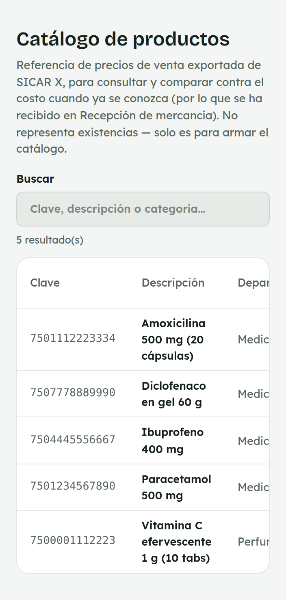
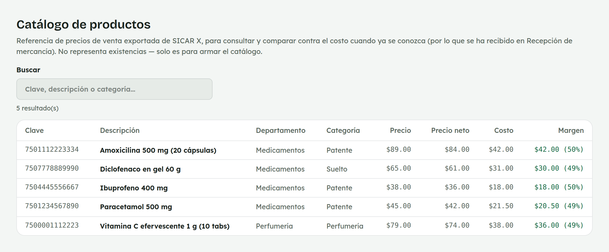

# 11. Cómo consultar el Catálogo de productos

**Para quién:** equipo de mostrador con acceso a Mercancía (hoy, el rol
**VENDEDOR PLUS**).
**Cuánto tarda:** medio minuto.

> Este tutorial empieza **después** de que ya entraste al panel (ver
> [tutorial 1](01-como-entrar-al-panel.md)). Es una pantalla de **solo
> lectura**: consultas precios, pero no puedes editarlos desde aquí.

> **Nota:** por ahora esta opción del menú solo la ve el personal con el
> rol **VENDEDOR PLUS** (por ejemplo, Mariana) — el resto del equipo de
> mostrador no la tiene todavía. Las capturas de esta guía se hicieron con
> una empleada de ejemplo (**Mariana Demo**) en una copia de prueba de la
> app — no son datos reales.

---

## Búscalo por clave, descripción o categoría

Menú ☰ → **Mercancía** → **"Catálogo de productos"**.

*En la computadora del mostrador:*

Es la lista de precios de venta que se exportó de SICAR X — sirve para
consultar y comparar contra el costo una vez que se conoce (por lo que se
ha recibido en [Recepción de mercancía](12-compras.md)). **No representa
existencias:** un producto puede aparecer aquí y estar agotado, o al
revés.

Usa el buscador para encontrar uno por su **clave**, su **descripción** o
su **categoría**.

## Precio, costo y margen

Cada renglón trae el **precio de venta** y el **precio neto** (después de
descuentos), y cuando ya se conoce el costo por haberlo recibido en una
recepción, también el **costo** y el **margen** — la diferencia entre el
precio y el costo, en pesos y en porcentaje.

> **En el celular:** desliza la tabla a los lados para ver las columnas
> "Costo" y "Margen".

---

## Para administración

Administración sube el catálogo exportado de SICAR X (el botón para
cargarlo no aparece para el resto del equipo) y decide qué roles tienen
acceso a esta pantalla desde Configuración → Usuarios.
