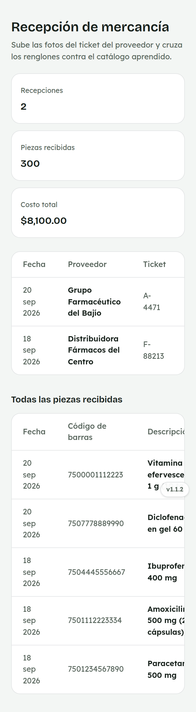
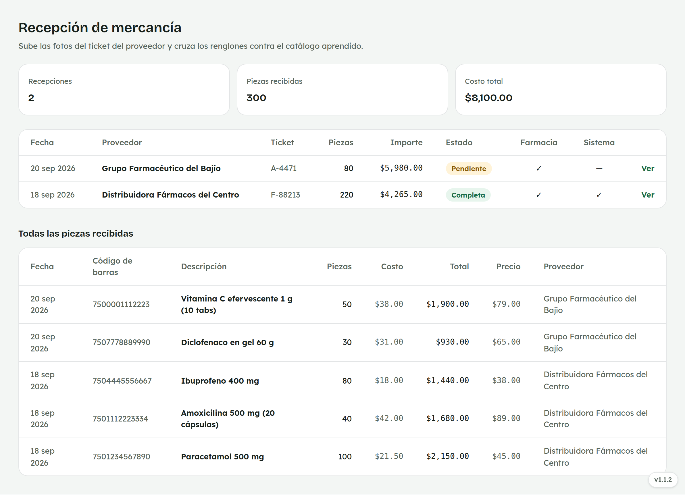
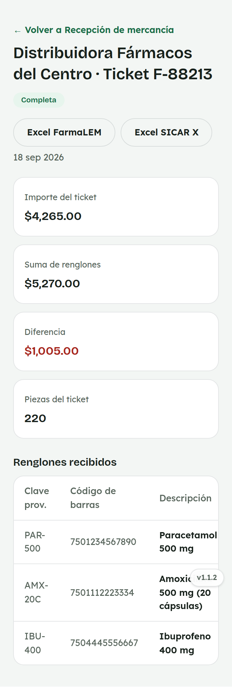
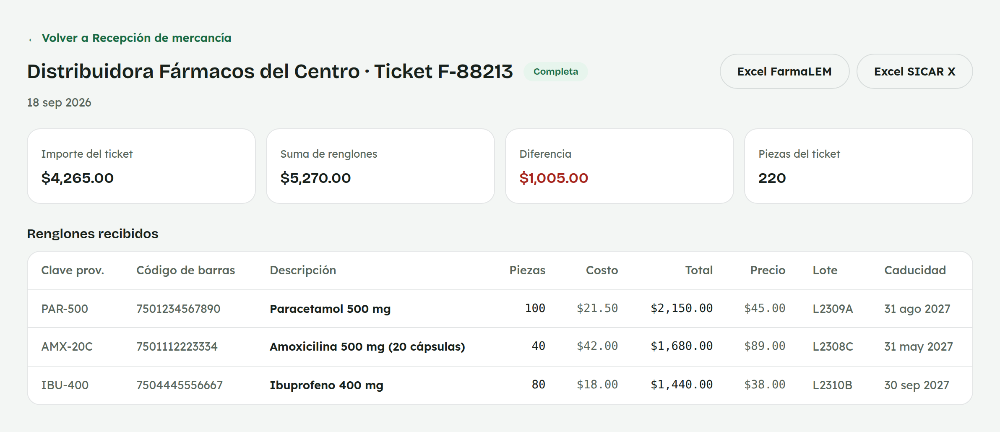
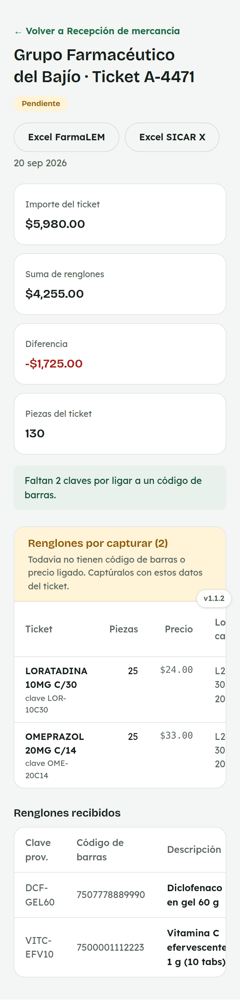
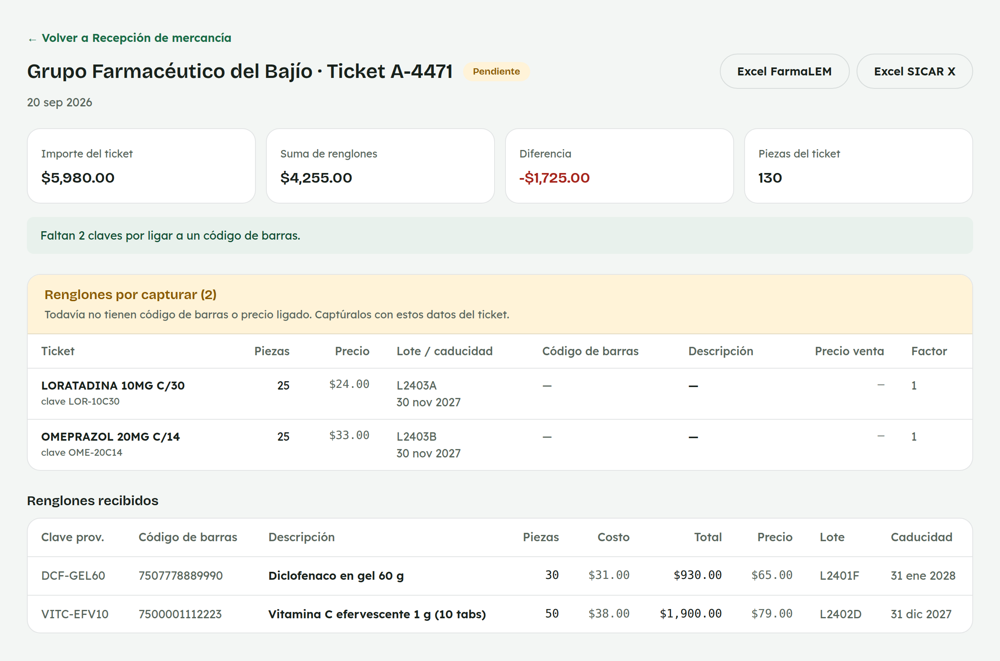

# 12. Cómo usar Recepción de mercancía

**Para quién:** equipo de mostrador con acceso a Mercancía (hoy, el rol
**VENDEDOR PLUS**).
**Cuánto tarda:** 3 minutos.

> Este tutorial empieza **después** de que ya entraste al panel (ver
> [tutorial 1](01-como-entrar-al-panel.md)).

> **Nota:** por ahora esta opción del menú solo la ve el personal con el
> rol **VENDEDOR PLUS** (por ejemplo, Mariana) — el resto del equipo de
> mostrador no la tiene todavía. Las capturas de esta guía se hicieron con
> una empleada de ejemplo (**Mariana Demo**) en una copia de prueba de la
> app — no son datos reales.

---

## La lista de recepciones

Menú ☰ → **Mercancía** → **"Recepción de mercancía"**.

*En la computadora del mostrador:*

Arriba ves el total de **recepciones**, **piezas recibidas** y **costo
total**. Debajo, cada recepción con su proveedor, ticket, piezas, importe
y estado (**"Pendiente"** o **"Completa"**), más si ya se acomodó en la
farmacia y si ya se capturó en el otro sistema — esas dos últimas solo se
pueden marcar desde aquí si eres administración; a ti te aparecen como
referencia (✓ o —).

Toca **"Ver"** para entrar al detalle de una recepción. Capturar una
recepción nueva (el botón **"+ Nueva recepción"**) es solo de
administración.

> **Más abajo:** "Todas las piezas recibidas" junta los renglones de
> todas las recepciones en una sola tabla, para buscar rápido un producto
> por su código de barras.

## Una recepción Completa

*En la computadora del mostrador:*

El detalle muestra el proveedor y el ticket, el **importe del ticket**
contra la **suma de los renglones** capturados (con la diferencia, si la
hay), las **piezas del ticket** y la tabla de **renglones recibidos**, ya
con su código de barras, costo, precio, lote y caducidad.

Los botones **"Excel FarmaLEM"** y **"Excel SICAR X"** exportan esa
recepción para el otro sistema — sí puedes usarlos aunque no seas
administración.

## Una recepción Pendiente: captúrala en SICAR X

*En la computadora del mostrador:*

Cuando un renglón del ticket todavía no tiene código de barras o precio
ligado en FarmaLEM, la recepción se queda en **"Pendiente"** y ese renglón
aparece arriba, en **"Renglones por capturar"**, con los datos tal como
vienen en el ticket (descripción, piezas, precio, lote y caducidad).

Esa tabla es de **solo lectura** para ti — captura esos mismos datos a
mano en SICAR X. Completar el renglón dentro de FarmaLEM (ligarlo a un
código de barras y un precio de venta) es tarea de administración.

> **En el celular:** desliza la tabla para ver todos los datos del
> renglón.

---

## Para administración

Administración es quien captura una recepción nueva (sube las fotos del
ticket y los renglones), completa los renglones pendientes ligándolos a
un código de barras y precio de venta, corrige el proveedor o los datos
del ticket si hace falta, y marca cuándo una recepción ya se acomodó en
la farmacia o ya se capturó en el otro sistema.
