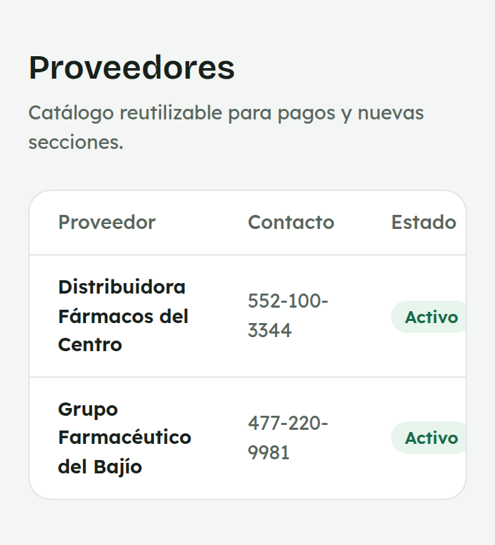
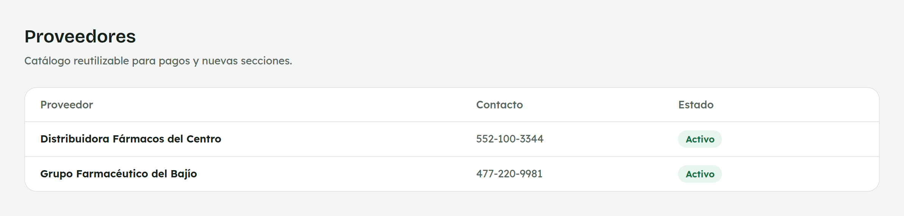

# 13. Cómo consultar Proveedores

**Para quién:** equipo de mostrador con acceso a Mercancía (hoy, el rol
**VENDEDOR PLUS**).
**Cuánto tarda:** medio minuto.

> Este tutorial empieza **después** de que ya entraste al panel (ver
> [tutorial 1](01-como-entrar-al-panel.md)). Es una pantalla de **solo
> lectura**.

> **Nota:** por ahora esta opción del menú solo la ve el personal con el
> rol **VENDEDOR PLUS** (por ejemplo, Mariana) — el resto del equipo de
> mostrador no la tiene todavía. Las capturas de esta guía se hicieron con
> una empleada de ejemplo (**Mariana Demo**) en una copia de prueba de la
> app — no son datos reales.

---

## La lista de proveedores

Menú ☰ → **Mercancía** → **"Proveedores"**.

*En la computadora del mostrador:*

Es el catálogo reutilizable de proveedores, con su **nombre**, **contacto**
y si está **activo**. Es de solo lectura para ti: no puedes dar de alta un
proveedor nuevo ni editar uno existente. Pero ese mismo catálogo es el que
se elige al capturar una recepción en
[Recepción de mercancía](12-compras.md).

---

## Para administración

Administración da de alta proveedores nuevos (botón **"+ Nuevo
proveedor"**) y edita el nombre o el contacto de uno existente — esos
controles no aparecen para el resto del equipo.
