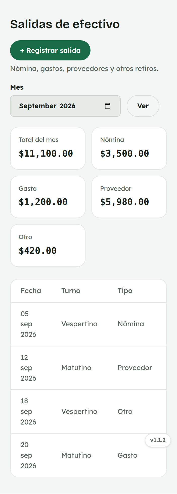
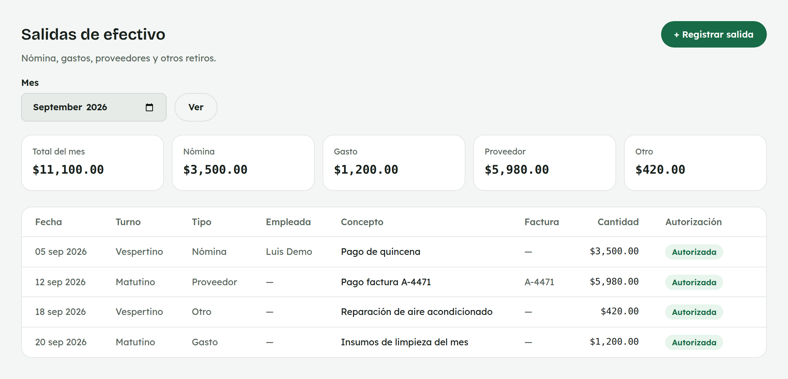
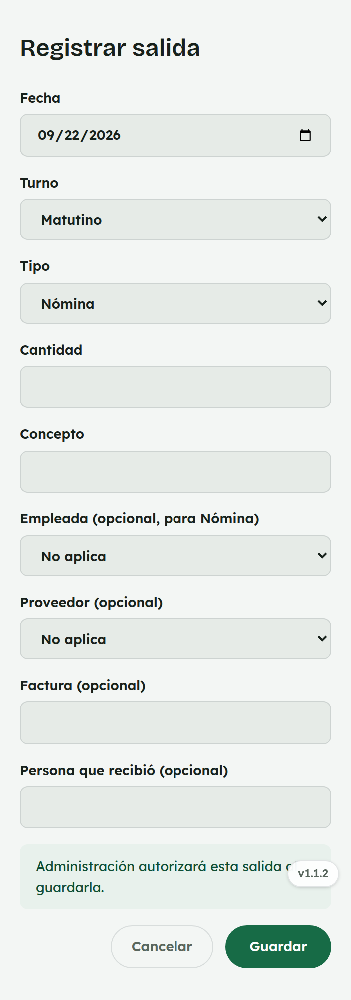
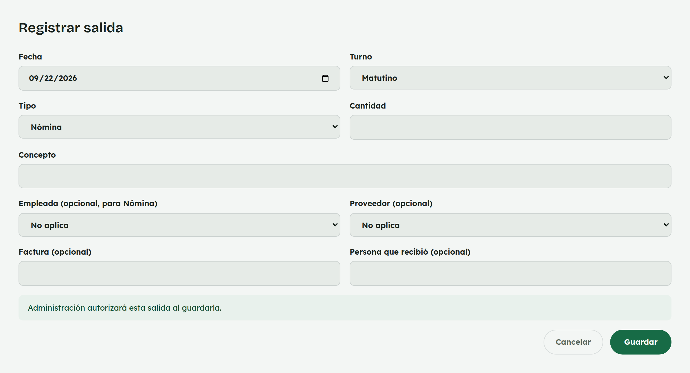

# 14. Cómo usar Salidas de efectivo

**Para quién:** administración.
**Cuánto tarda:** 2 minutos.

> **Nota:** las capturas de esta guía se hicieron en una copia de prueba de
> la app (empleada de ejemplo **Rocío Demo**) — no son datos reales.

---

## La lista de salidas

Menú ☰ → **Caja** → **"Salidas de efectivo"**.

*En la computadora:*

Arriba ves el total del mes y el desglose por tipo (**Nómina**, **Gasto**,
**Proveedor**, **Otro**). Debajo, cada salida con su fecha, turno y tipo.

## Registrar una salida

*En la computadora:*

Toca **"+ Registrar salida"**: fecha, turno, tipo, cantidad y concepto son
obligatorios; proveedor, empleada, factura y quién recibió son opcionales
según el tipo.

Al guardar queda **autorizada de una vez** — no hay un paso aparte de
aprobación.
