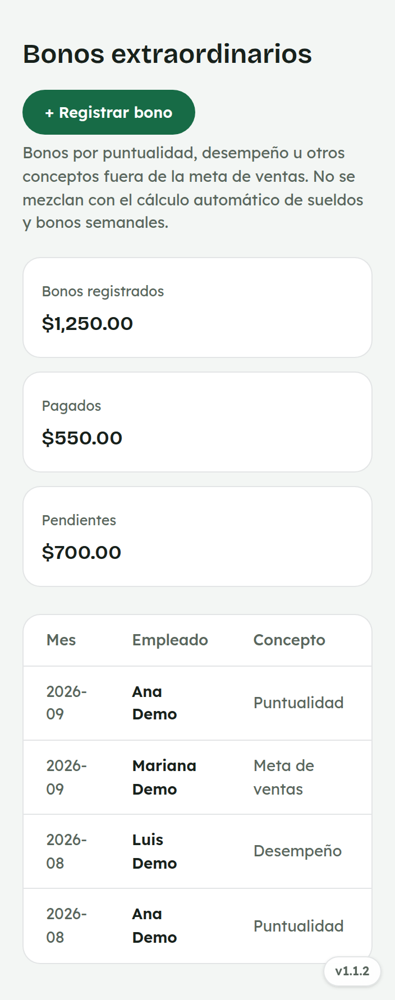
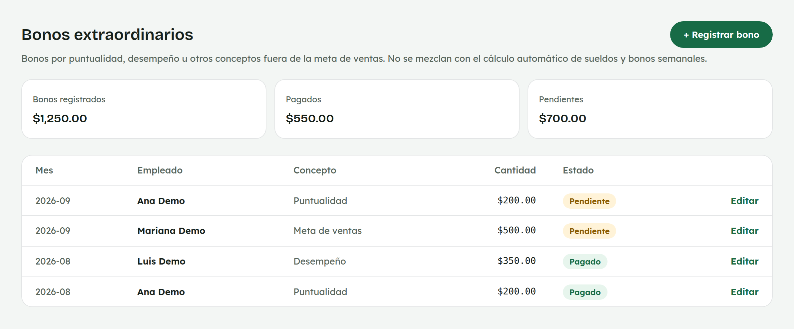
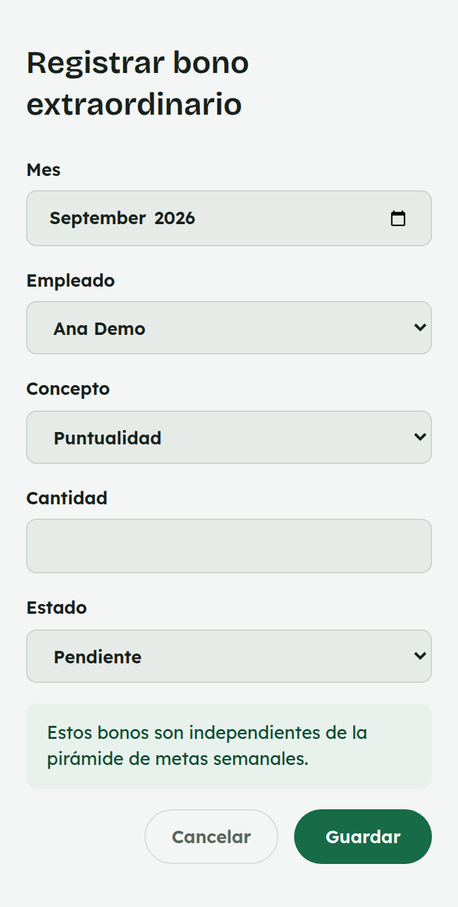
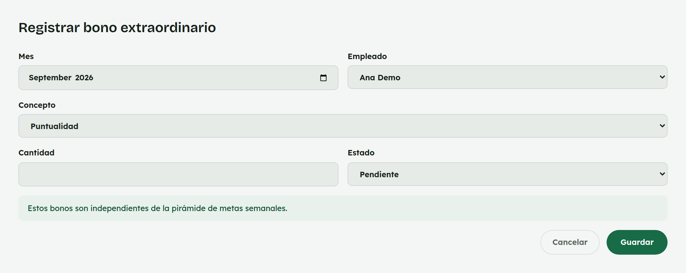

# 15. Cómo registrar Bonos extraordinarios

**Para quién:** administración.
**Cuánto tarda:** 2 minutos.

> **Nota:** las capturas de esta guía se hicieron en una copia de prueba de
> la app (empleada de ejemplo **Rocío Demo**) — no son datos reales.

---

## La lista de bonos

Menú ☰ → **Personal** → **"Bonos extraordinarios"**.

*En la computadora:*

Arriba ves el total registrado, lo ya pagado y lo pendiente. La tabla
muestra mes, empleada, concepto, cantidad y estado (**Pendiente**/**Pagado**)
— toca **"Editar"** para corregir cualquier dato, incluido el estado.

## Registrar un bono

*En la computadora:*

Elige el mes, la empleada activa, el concepto (**Puntualidad**,
**Desempeño**, **Meta de ventas** u **Otro**), la cantidad y si ya está
pagado.

> Este bono **no altera** el cálculo automático del bono semanal por meta
> de ventas, pero sí se suma al total a pagar en
> [Sueldos y salarios](17-sueldos.md) y al
> [Estado de resultados](20-finanzas.md) del mes.
