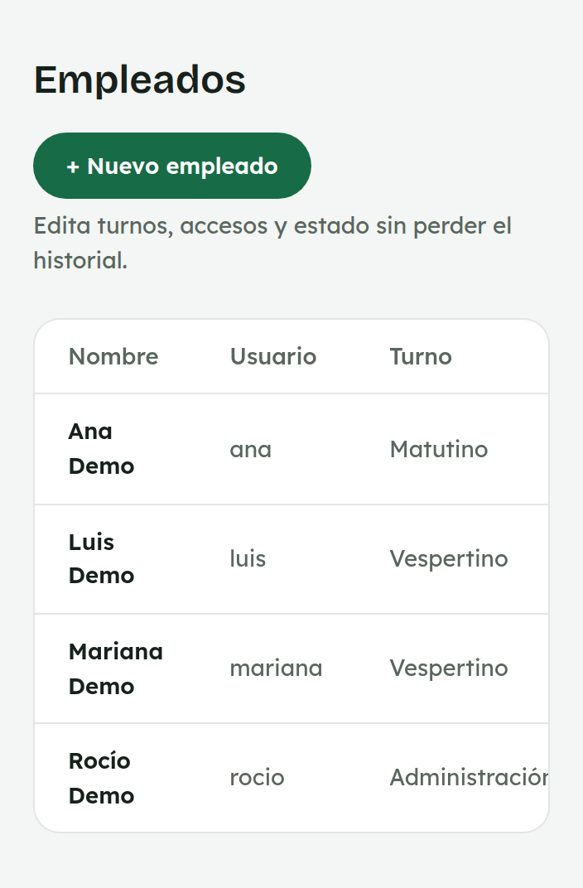
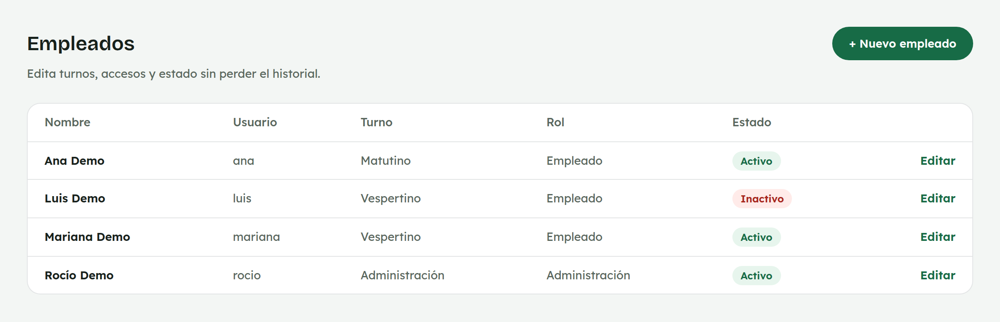
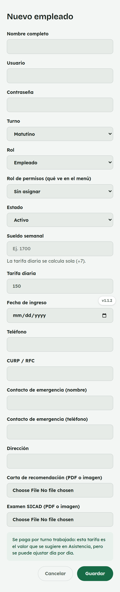
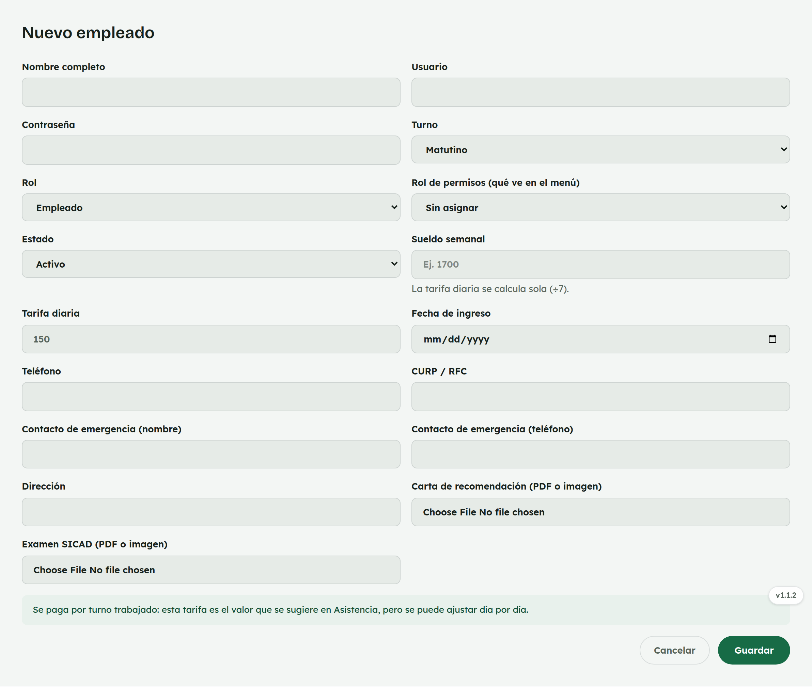

# 16. Cómo usar Empleados

**Para quién:** administración.
**Cuánto tarda:** 3 minutos.

> **Nota:** las capturas de esta guía se hicieron en una copia de prueba de
> la app (empleada de ejemplo **Rocío Demo**) — no son datos reales.

---

## El directorio del equipo

Menú ☰ → **Personal** → **"Empleados"**.

*En la computadora:*

La lista incluye tanto a quienes están activas como a las que ya no —
**desactivar** (en vez de borrar) conserva su historial de cortes,
asistencia y sueldos.

## Alta o edición

*En la computadora:*

Datos personales, turno, tarifa diaria, **rol de permisos** (el que decide
qué pantallas ve — distinto del acceso admin/empleada de siempre),
documentos y, al editar, el PIN del reloj checador.

> Para **borrar** a alguien hace falta el PIN de eliminación configurado en
> [Configuración](26-configuracion.md), y solo se puede si esa persona no
> tiene ningún corte, falta o sueldo capturado — si ya tiene historial,
> desactívala en vez de borrarla.
