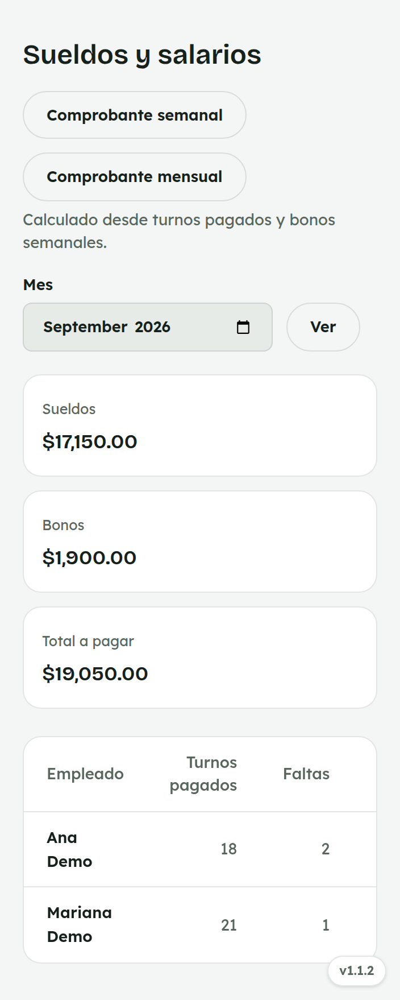
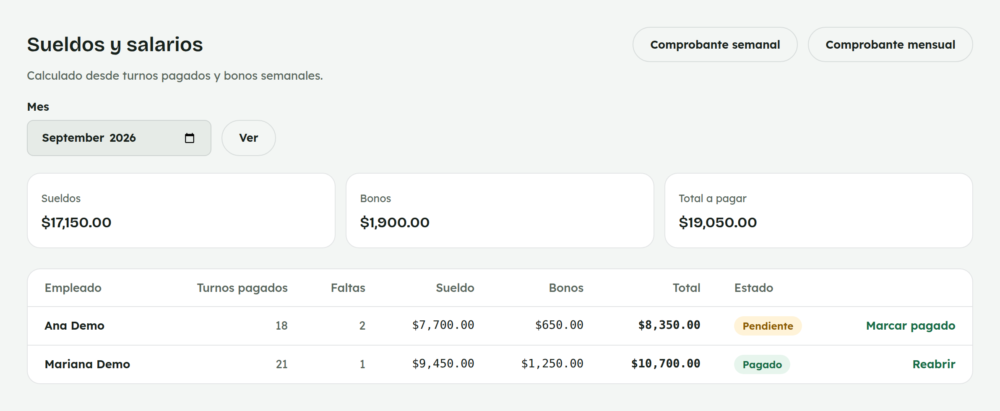
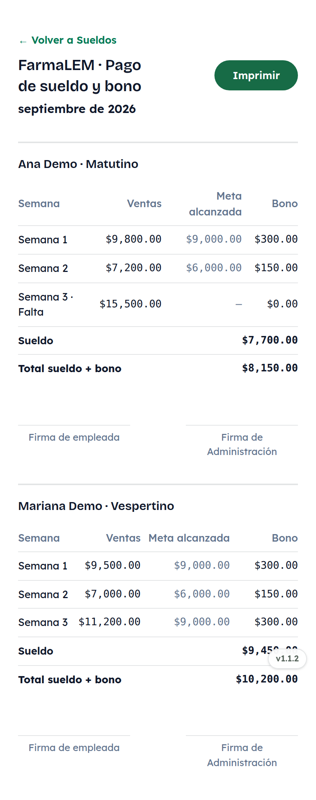
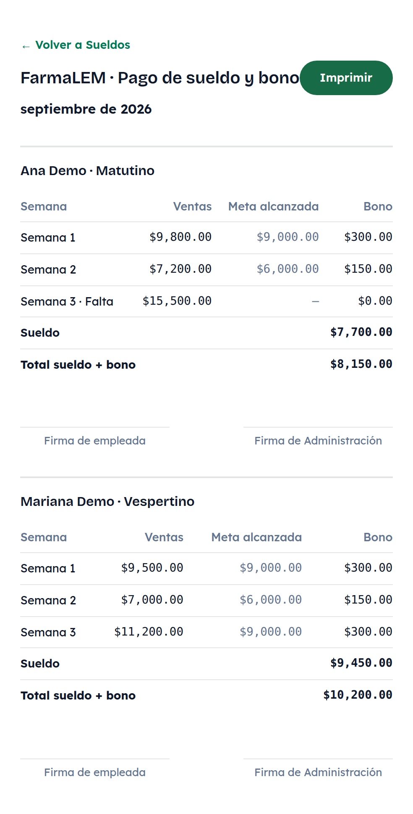

# 17. Cómo usar Sueldos y salarios

**Para quién:** administración.
**Cuánto tarda:** 3 minutos.

> **Nota:** las capturas de esta guía se hicieron en una copia de prueba de
> la app (empleadas de ejemplo **Ana Demo** / **Mariana Demo**, vistas por
> **Rocío Demo**) — no son datos reales.

---

## La nómina del mes

Menú ☰ → **Personal** → **"Sueldos y salarios"**.

*En la computadora:*

El **sueldo** de cada quien es la suma de la tarifa de los días con
"Asistió" o "Cubrió turno" en [Asistencia](06-asistencia.md) — sábado y
domingo pagan doble tarifa por cubrir el día completo. El **bono** junta el
bono semanal por meta de ventas y cualquier
[bono extraordinario](15-bonos-extra.md) del mes.

Marca **"Pagado"** cuando ya se entregó.

## Comprobante mensual

*En la computadora:*

Un desglose por semana, con las ventas de esa semana, la meta alcanzada y
el bono — listo para firmar e imprimir.

> **Importante:** si una semana tuvo una falta, el bono de esa semana se va
> a **cero** aunque la meta de ventas sí se haya alcanzado — así se ve en
> la Semana 3 del ejemplo (Ana Demo: $15,500 en ventas, pero $0 de bono por
> la falta).

También existe un **"Comprobante semanal"** para revisar una sola semana de
todo el equipo junta.
