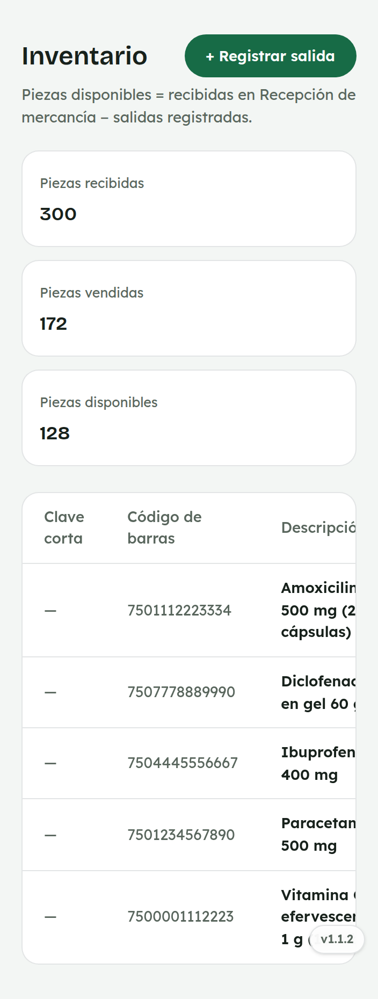
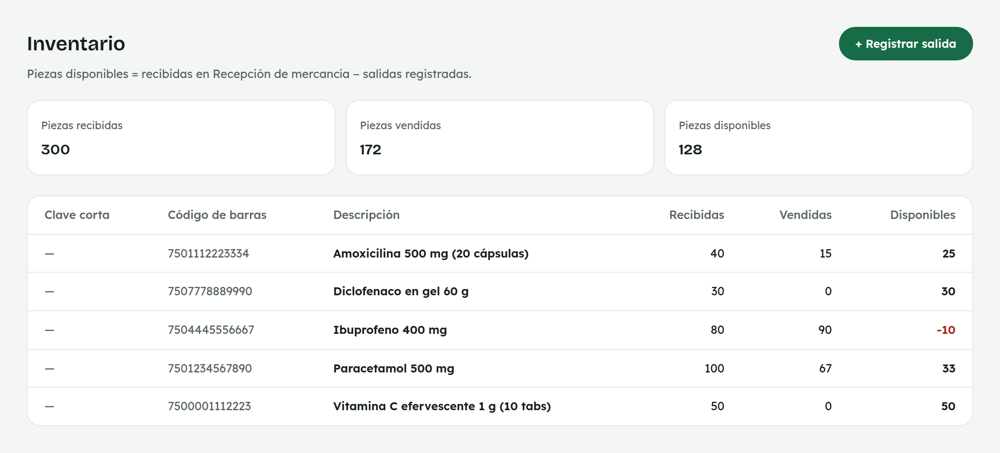
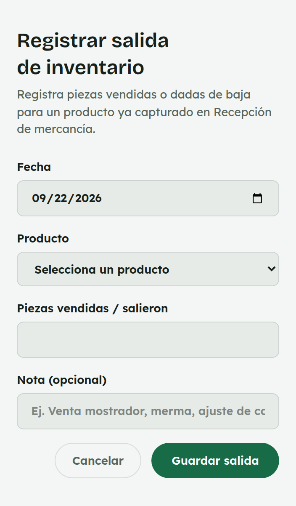
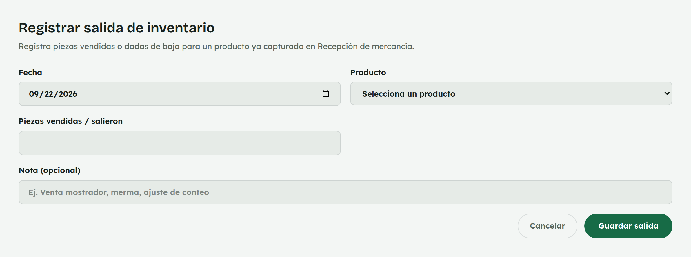

# 18. Cómo usar Inventario

**Para quién:** administración.
**Cuánto tarda:** 2 minutos.

> **Nota:** las capturas de esta guía se hicieron en una copia de prueba de
> la app (empleada de ejemplo **Rocío Demo**) — no son datos reales.

---

## El resumen por producto

Menú ☰ → **Mercancía** → **"Inventario"**.

*En la computadora:*

Cada renglón junta lo recibido en
[Recepción de mercancía](12-compras.md) con las salidas registradas aquí
(ventas, mermas, caducidad) para dar lo **disponible** — en rojo cuando es
cero o negativo.

> Si un producto nunca se ha recibido en una recepción, **no aparece** en
> esta lista todavía.

## Registrar una salida

*En la computadora:*

Elige el producto (por clave o código de barras), la fecha, la cantidad y,
si quieres, una nota — por ejemplo "Venta de mostrador" o "Caducado, se dio
de baja".
