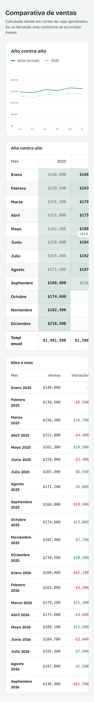
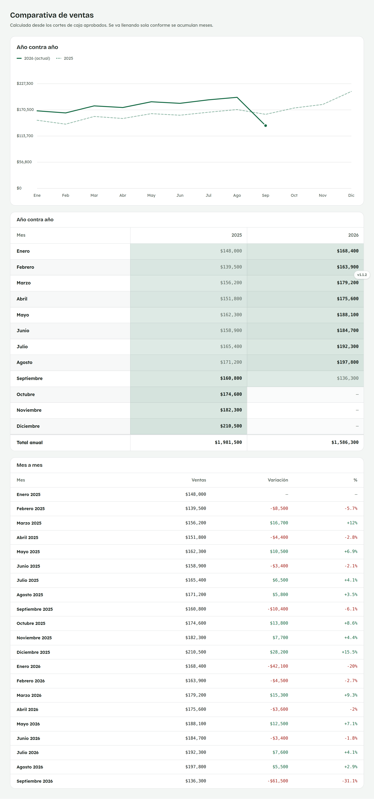

# 19. Cómo consultar la Comparativa de ventas

**Para quién:** administración.
**Cuánto tarda:** 2 minutos.

> **Nota:** las capturas de esta guía se hicieron en una copia de prueba de
> la app (empleada de ejemplo **Rocío Demo**) — no son datos reales.

---

## Año contra año y mes a mes

Menú ☰ → **Finanzas** → **"Comparativa de ventas"**.

*En la computadora:*

Solo cuenta cortes ya **Aprobados**; los meses de antes de usar el panel se
llenan con un total capturado a mano una sola vez.

La tabla **"Año contra año"** resalta en negritas el mejor mes de cada
renglón; **"Mes a mes"** muestra la variación en pesos y en porcentaje
contra el mes anterior.

> **Un mes todavía en curso se ve más bajo** que uno ya cerrado — no está
> prorrateado, así que la variación contra el mes anterior puede verse muy
> negativa hasta que el mes termine. Es normal.
