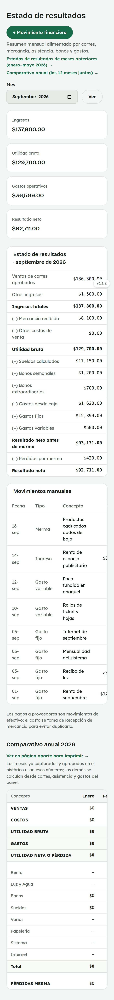
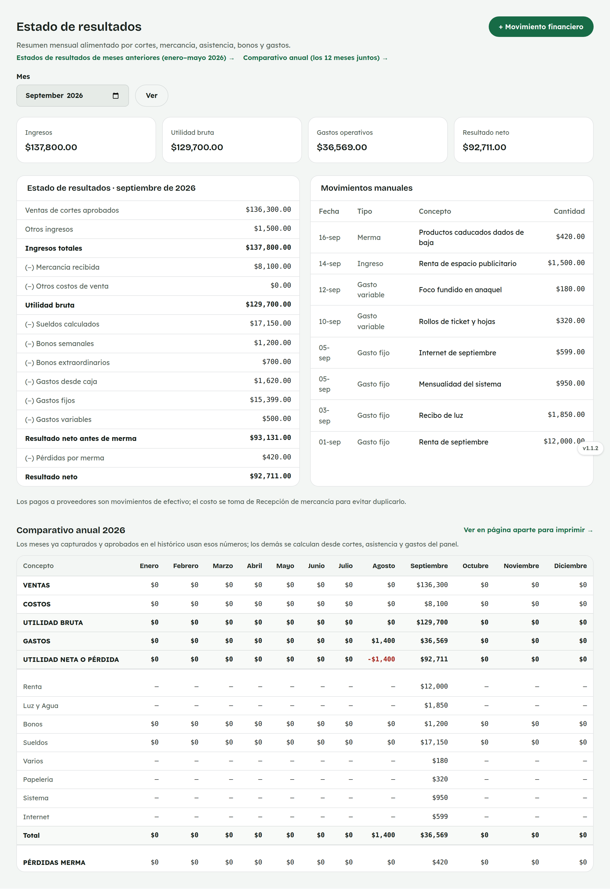

# 20. Cómo usar el Estado de resultados

**Para quién:** administración.
**Cuánto tarda:** 3 minutos.

> **Nota:** las capturas de esta guía se hicieron en una copia de prueba de
> la app (empleada de ejemplo **Rocío Demo**) — no son datos reales.

---

## El estado de resultados del mes

Menú ☰ → **Finanzas** → **"Estado de resultados"**.

*En la computadora:*

Se arma solo, jalando datos de otras pantallas:

- Las **ventas** de los cortes aprobados.
- El **costo** de lo recibido en [Recepción de mercancía](12-compras.md)
  — no de los pagos a proveedores en [Salidas](14-salidas.md), para no
  contar el costo dos veces.
- Los **sueldos** calculados y **bonos** (ver
  [Sueldos y salarios](17-sueldos.md)).
- Los **gastos fijos/variables** capturados en
  [Gastos fijos y variables](21-gastos.md).

La tabla **"Movimientos manuales"** son los ingresos, costos, gastos y
mermas que se capturan aparte con **"+ Movimiento financiero"**.

> **"Gastos desde caja"** solo cuenta las Salidas de tipo **Gasto** u
> **Otro** — Nómina y Proveedor ya se cuentan en Sueldos y en Mercancía
> recibida, respectivamente.

El **"Comparativo anual"**, al final de la pantalla, junta los 12 meses del
año en una sola tabla (también se puede abrir aparte para imprimir).
