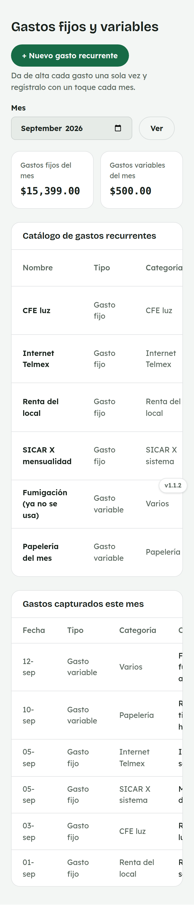
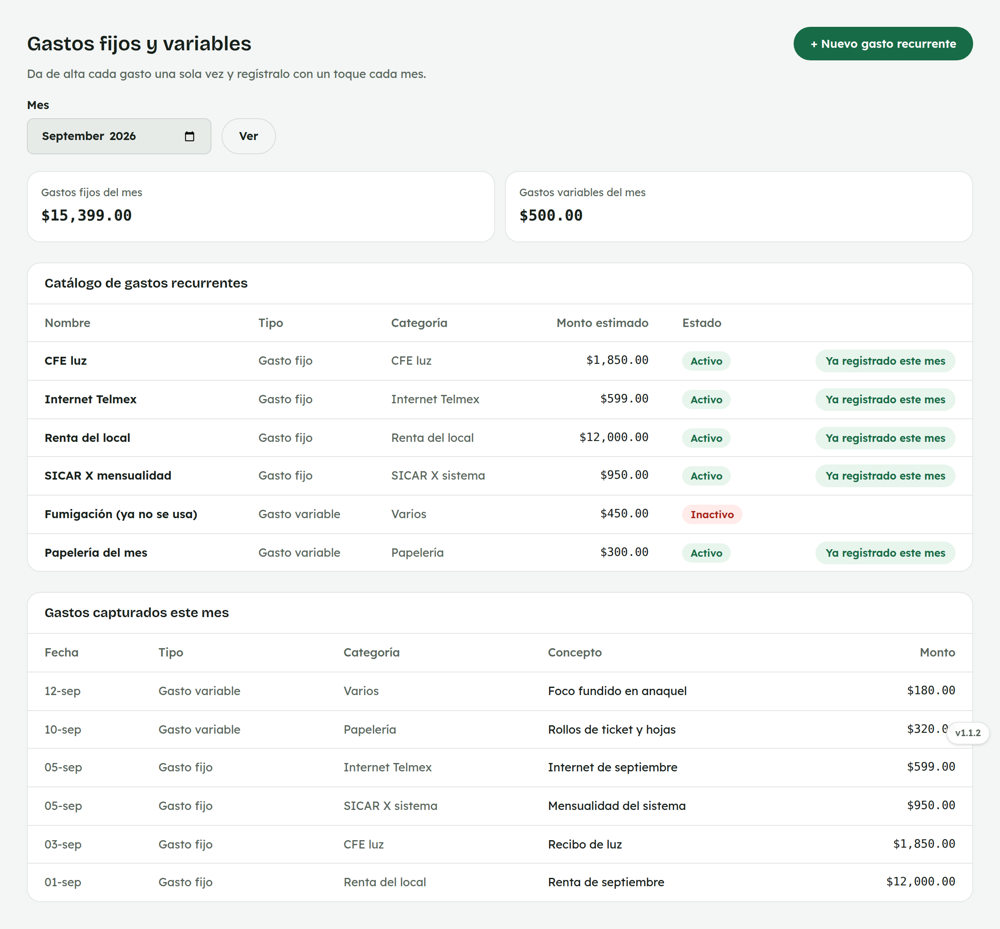

# 21. Cómo usar Gastos fijos y variables

**Para quién:** administración.
**Cuánto tarda:** 2 minutos.

> **Nota:** las capturas de esta guía se hicieron en una copia de prueba de
> la app (empleada de ejemplo **Rocío Demo**) — no son datos reales.

---

## El catálogo de gastos recurrentes

Menú ☰ → **Finanzas** → **"Gastos fijos y variables"**.

*En la computadora:*

Da de alta **una vez** cada gasto que se repite (renta, luz, el sistema,
internet…) con **"+ Nuevo gasto recurrente"**; cada mes solo toca
**"Capturar"** en el que ya corresponda — el botón desaparece en cuanto ya
se capturó ese gasto este mes.

Debajo, **"Gastos capturados este mes"** son los movimientos ya guardados.

> Usa nombres reconocibles en la categoría (Renta, CFE, SICAR X…) — así se
> agrupan bien en el
> [comparativo anual del Estado de resultados](20-finanzas.md).
