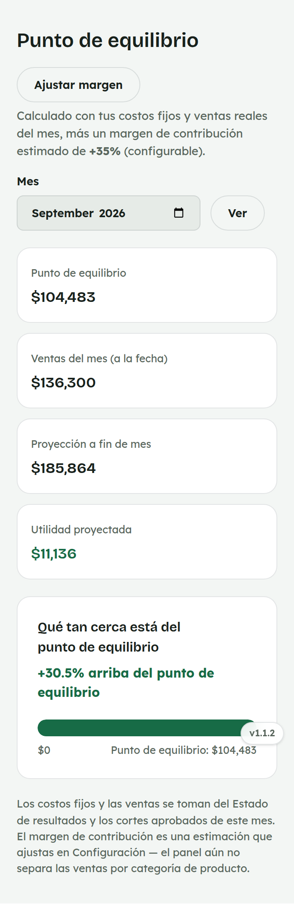
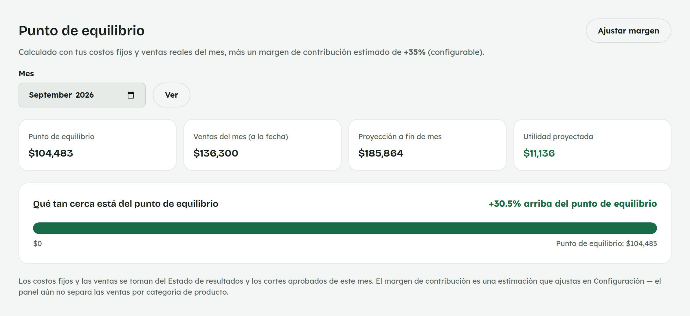

# 22. Cómo consultar el Punto de equilibrio

**Para quién:** administración.
**Cuánto tarda:** 2 minutos.

> **Nota:** las capturas de esta guía se hicieron en una copia de prueba de
> la app (empleada de ejemplo **Rocío Demo**) — no son datos reales.

---

## Qué tan cerca está del punto de equilibrio

Menú ☰ → **Finanzas** → **"Punto de equilibrio"**.

*En la computadora:*

Se calcula como los **gastos operativos** del mes (los mismos del
[Estado de resultados](20-finanzas.md)) entre el **margen de contribución**
estimado — un solo porcentaje global que se ajusta en
[Configuración](26-configuracion.md), porque el panel todavía no separa
las ventas por categoría de producto.

La **"Proyección a fin de mes"** es una simple regla de tres con lo
vendido hasta hoy entre los días transcurridos.

> Para explorar mezclas de venta hipotéticas sin tocar tus datos reales,
> usa el [Simulador de escenarios](23-simulador-escenarios.md).
