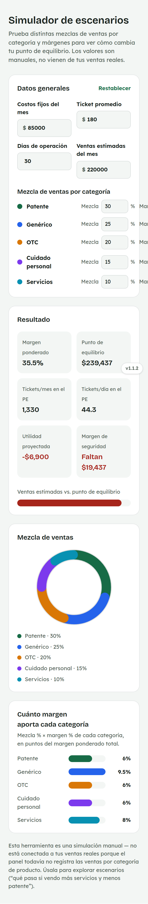
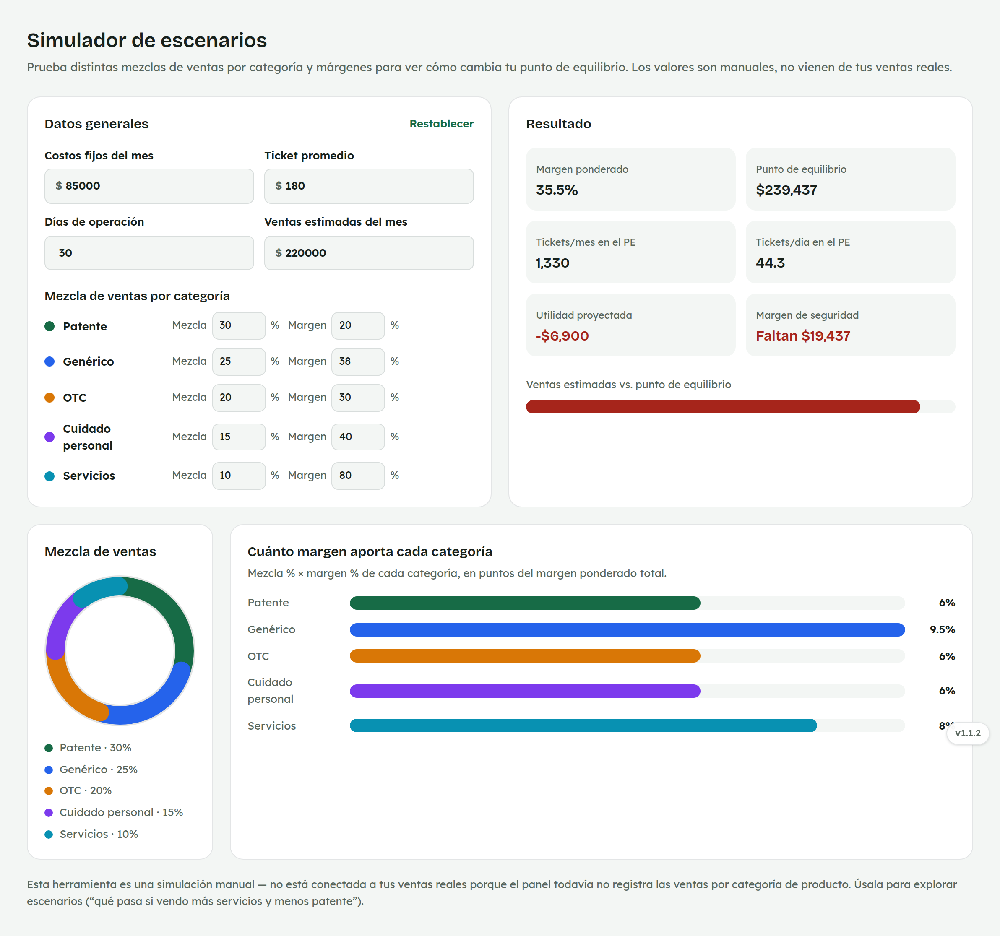

# 23. Cómo usar el Simulador de escenarios

**Para quién:** administración.
**Cuánto tarda:** 2 minutos.

> **Nota:** las capturas de esta guía se hicieron en una copia de prueba de
> la app (empleada de ejemplo **Rocío Demo**) — no son datos reales.

---

## Explora escenarios hipotéticos

Menú ☰ → **Finanzas** → **"Simulador de escenarios"**.

*En la computadora:*

A diferencia de [Punto de equilibrio](22-punto-equilibrio.md), esta
pantalla **no está conectada a tus ventas reales** — todos los valores
(costos fijos, ticket promedio, ventas estimadas y la mezcla por
categoría) los escribes tú, para explorar preguntas como "¿qué pasa si
vendo más servicios y menos patente?".

> La suma de los porcentajes de mezcla debe dar 100%, o aparece un aviso.
