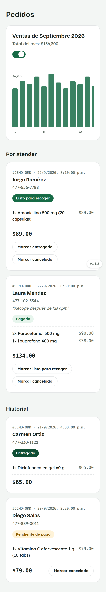
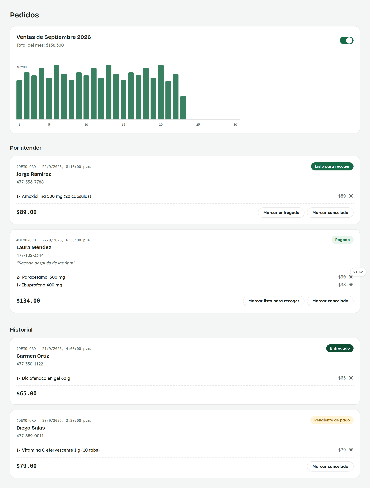

# 24. Cómo usar Pedidos

**Para quién:** administración.
**Cuánto tarda:** 2 minutos.

> **Nota:** las capturas de esta guía se hicieron en una copia de prueba de
> la app (empleada de ejemplo **Rocío Demo**) — no son datos reales.

---

## Por atender e Historial

Menú ☰ → **"Pedidos"**.

*En la computadora:*

Arriba, la gráfica de ventas diarias del mes (de los cortes aprobados).

**"Por atender"** son los pedidos ya pagados o listos para recoger;
**"Historial"** junta los pendientes de pago, entregados y cancelados.

Cada pedido muestra sus productos, el total y los botones para avanzar su
estado.
