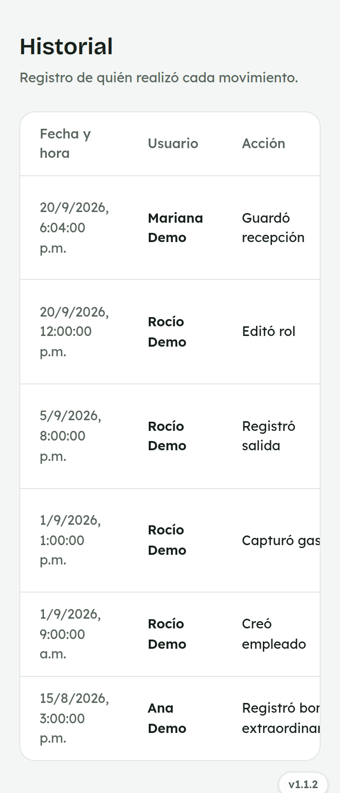
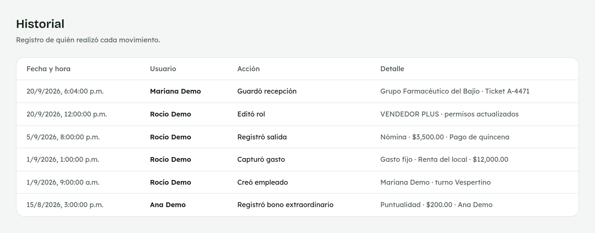

# 25. Cómo consultar el Historial

**Para quién:** administración.
**Cuánto tarda:** 1 minuto.

> **Nota:** las capturas de esta guía se hicieron en una copia de prueba de
> la app (empleada de ejemplo **Rocío Demo**) — no son datos reales.

---

## El registro de actividad

Menú ☰ → **"Historial"**.

*En la computadora:*

Una sola lista de **solo lectura**, la más reciente primero, con hasta 200
movimientos: quién lo hizo, qué acción fue y el detalle.

Casi cada pantalla del panel deja su propia entrada aquí (registrar una
salida, capturar un gasto, editar un rol…), así que sirve para reconstruir
qué pasó sin tener que preguntar.
