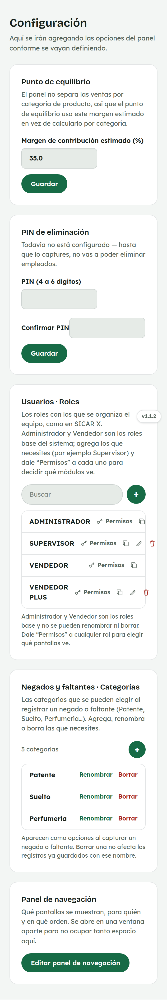
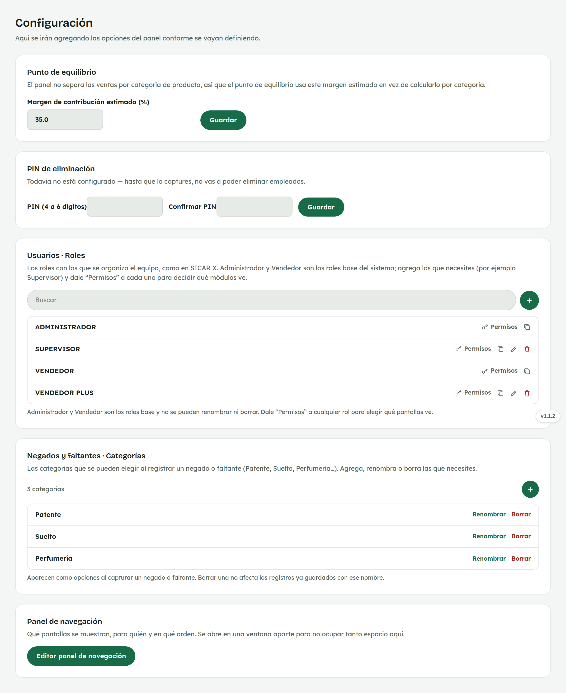
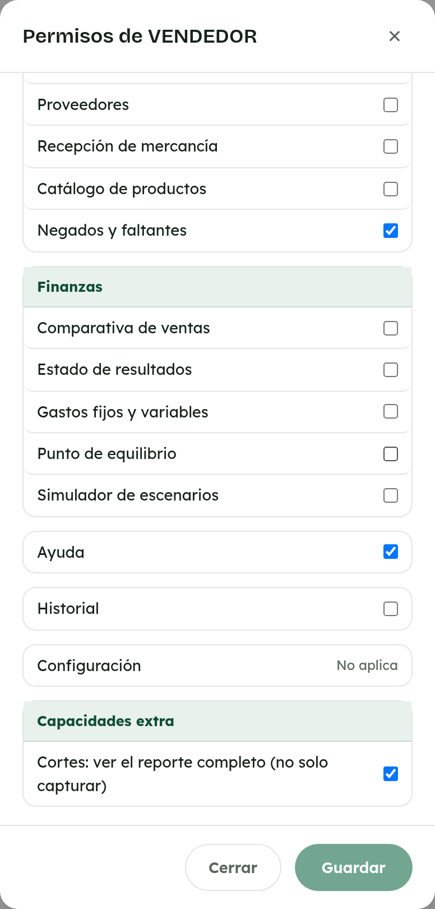
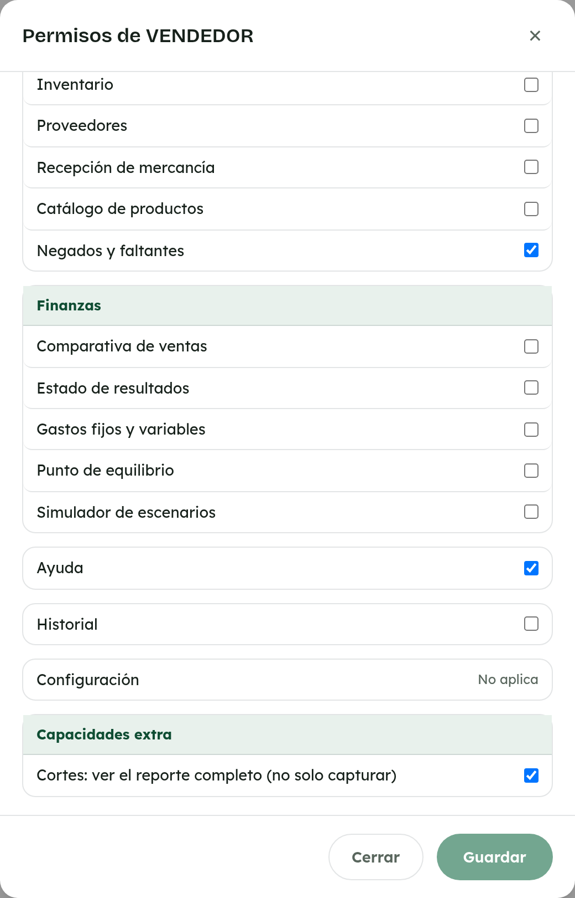

# 26. Cómo usar Configuración

**Para quién:** administración.
**Cuánto tarda:** 4 minutos.

> **Nota:** las capturas de esta guía se hicieron en una copia de prueba de
> la app (empleada de ejemplo **Rocío Demo**) — no son datos reales.

---

## Las cinco secciones

Menú ☰ → **"Configuración"**.

*En la computadora:*

De arriba a abajo:

1. El **margen estimado** que usa [Punto de equilibrio](22-punto-equilibrio.md).
2. El **PIN de eliminación** — hace falta configurarlo antes de poder
   borrar un empleado o un rol.
3. **"Usuarios · Roles"**, donde se dan de alta los roles de permisos y se
   accede a sus **Permisos**.
4. Las **categorías de Negados y faltantes**.
5. **"Panel de navegación"**, que abre aparte el editor de qué pantallas
   se muestran, para quién y en qué orden.

## Permisos de un rol y Capacidades extra

*En la computadora:*

Toca **"Permisos"** junto a cualquier rol para elegir qué pantallas ve,
agrupadas igual que el menú.

Al final aparece **"Capacidades extra"** — no son pantallas nuevas, sino un
nivel distinto dentro de una pantalla que ya ve todo el mundo: por ejemplo,
cualquiera puede capturar un corte en [Cortes](04-capturar-corte-del-dia.md),
pero solo quien tenga marcada **"Cortes: ver el reporte completo"** ve
también los montos de todo el equipo ahí mismo; sin ella, esa pantalla solo
le muestra el botón **"+ Capturar corte"**.

> No olvides **"Guardar"** — cerrar el modal sin guardar descarta los
> cambios.
